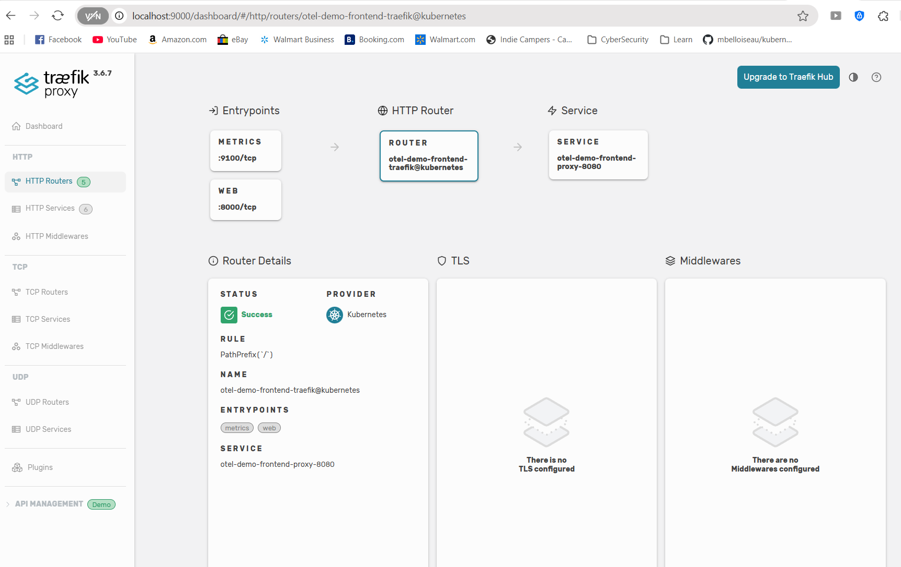

# Demo-03: Expose OTel Demo Frontend Using Ingress

## Demo Overview

This demo exposes the OpenTelemetry Demo frontend application using Kubernetes Ingress resources. You'll create the **same Ingress** twice - once using the AWS Load Balancer Controller and once using Traefik - to understand the differences in provisioning, architecture, and behavior between the two controllers.

**What you'll do:**
- Create an Ingress using AWS Load Balancer Controller (provisions AWS ALB)
- Create an Ingress using Traefik (uses existing NLB)
- Access the frontend through both load balancers
- Compare provisioning time, AWS resources, and architecture
- Understand trade-offs between the two approaches

## Prerequisites

**From Previous Demos:**
- ✅ Completed `00-otel-demo-app` - OTel Demo running in EKS cluster
- ✅ Completed `01-aws-alb-controller` - AWS LB Controller installed
- ✅ Completed `02-traefik-controller` - Traefik installed

**Required Tools:**
- kubectl v1.27+
- AWS CLI v2
- curl or web browser

**Verify Prerequisites:**
```bash
# Check OTel Demo is running
kubectl get pods -n otel-demo
# Expected: All pods Running

# Check both controllers are installed
kubectl get deployment -n kube-system aws-load-balancer-controller
kubectl get deployment -n traefik traefik
# Expected: Both deployments READY

# Check IngressClasses exist
kubectl get ingressclass
# Expected: alb and traefik both present
```

## Demo Objectives

By the end of this demo, you will:

1. ✅ Create Ingress resources for both controllers
2. ✅ Understand how each controller provisions load balancers
3. ✅ Compare provisioning time and AWS resource creation
4. ✅ Access the frontend through both endpoints
5. ✅ Understand when to use which controller

## Architecture Comparison

### **AWS Load Balancer Controller Flow:**
```
Internet
    ↓
AWS Application Load Balancer (ALB) ← Created by controller
    ↓
Target Group (IP targets)
    ↓
frontend-proxy Pods (port 8080)
```

### **Traefik Flow:**
```
Internet
    ↓
AWS Network Load Balancer (NLB) ← Already exists from Traefik install
    ↓
Traefik Pods (routing logic)
    ↓
frontend-proxy Pods (port 8080)
```

**Key Difference:**
- **ALB Controller:** Load balancing happens in AWS (managed service)
- **Traefik:** Load balancing happens in Kubernetes pods (software)

## Directory Structure

```
03-expose-frontend/
├── README.md
├── images
│   └── traefik-db.png
└── src
    ├── frontend-alb-ingress.yaml
    └── frontend-traefik-ingress.yaml
```

# Demo Instructions

## Part A: Expose Frontend with AWS Load Balancer Controller

### Step 1: Understand the Target Service

**1.1 Verify the frontend-proxy service:**

```bash
kubectl get svc frontend-proxy -n otel-demo
```

**Expected output:**
```
NAME             TYPE        CLUSTER-IP      EXTERNAL-IP   PORT(S)    AGE
frontend-proxy   ClusterIP   10.100.123.45   <none>        8080/TCP   2h
```

**Key points:**
- Service name: `frontend-proxy`
- Port: `8080`
- Type: `ClusterIP` (internal only, not exposed yet)

**1.2 Check service endpoints:**

```bash
kubectl get endpoints frontend-proxy -n otel-demo
```

**Expected output:**
```
NAME             ENDPOINTS                           AGE
frontend-proxy   192.168.x.x:8080,192.168.y.y:8080   2h
```

This shows pod IPs that will become ALB targets.

---

### Step 2: Create Ingress Resource (ALB Controller)

**2.1 Create the Ingress manifest:**

Create `frontend-alb-ingress.yaml`:

**Annotation explanations:**
- `scheme: internet-facing` - ALB accessible from internet (vs `internal`)
- `target-type: ip` - ALB sends traffic directly to pod IPs (vs EC2 instance IPs)
- `healthcheck-path: /` - ALB health check endpoint
- `success-codes: "200"` - HTTP 200 = healthy

**2.2 Apply the Ingress:**

```bash
kubectl apply -f frontend-alb-ingress.yaml
```

**Expected output:**
```
ingress.networking.k8s.io/frontend-alb created
```

---

### Step 3: Monitor ALB Provisioning

**3.1 Watch Ingress status:**

```bash
kubectl get ingress frontend-alb -n otel-demo -w
```

**You'll see:**
```
NAME           CLASS   HOSTS   ADDRESS                                         PORTS   AGE
frontend-alb   alb     *       <pending>                                       80      5s
frontend-alb   alb     *       k8s-oteldemo-frontend-abc123.elb.us-east-2...  80      90s
```

The ADDRESS field populates when the ALB is ready (~2-3 minutes).

**3.2 Check controller logs:**

```bash
kubectl logs -n kube-system deployment/aws-load-balancer-controller --tail=50 | grep frontend-alb
```

**Look for:**
```
"msg":"creating LoadBalancer"
"msg":"creating TargetGroup"
"msg":"registering targets"
"msg":"created"
```

**3.3 View detailed Ingress status:**

```bash
kubectl describe ingress frontend-alb -n otel-demo
```

**Look for Events section:**
```
Events:
  Type    Reason                Age   Message
  ----    ------                ----  -------
  Normal  SuccessfullyReconciled  2m   Successfully reconciled
```

---

### Step 4: Verify AWS Resources Created

**4.1 Get the ALB DNS name:**

```bash
ALB_DNS=$(kubectl get ingress frontend-alb -n otel-demo -o jsonpath='{.status.loadBalancer.ingress[0].hostname}')
echo "ALB DNS: $ALB_DNS"
```

**4.2 Find the ALB in AWS Console:**

```bash
# List ALBs created by the controller
aws elbv2 describe-load-balancers \
  --query 'LoadBalancers[?contains(LoadBalancerName, `k8s-oteldemo`)].{Name:LoadBalancerName,DNS:DNSName,State:State.Code}' \
  --output table

aws elbv2 describe-load-balancers \
  --query 'LoadBalancers[].{Name:LoadBalancerName,DNS:DNSName,Type:Type,State:State.Code}' \
  --output table
```

**4.3 Check Target Group:**

```bash
# Get target group ARN
TG_ARN=$(aws elbv2 describe-target-groups \
  --query 'TargetGroups[?contains(TargetGroupName, `k8s-oteldemo-frontend`)].TargetGroupArn' \
  --output text)

# Check registered targets
aws elbv2 describe-target-health --target-group-arn $TG_ARN
```

**Expected output:**
```json
{
    "TargetHealthDescriptions": [
        {
            "Target": {
                "Id": "192.168.x.x",  # Pod IP
                "Port": 8080
            },
            "HealthCheckPort": "8080",
            "TargetHealth": {
                "State": "healthy"
            }
        }
    ]
}
```

**4.4 Check Security Groups:**

```bash
# Find ALB security group
aws elbv2 describe-load-balancers \
  --load-balancer-arns $(aws elbv2 describe-load-balancers \
    --query 'LoadBalancers[?contains(LoadBalancerName, `k8s-oteldemo`)].LoadBalancerArn' \
    --output text) \
  --query 'LoadBalancers[0].SecurityGroups' \
  --output table
```

---

### Step 5: Access the Frontend via ALB

**5.1 Test HTTP access:**

```bash
curl -I http://$ALB_DNS
```

**Expected output:**
```
HTTP/1.1 200 OK
Content-Type: text/html
...
```

**5.2 Access in browser:**

```bash
echo "Open in browser: http://$ALB_DNS"
```

**You should see:**
- OpenTelemetry Demo "Astronomy Shop" homepage
- Product listings
- Shopping cart functionality

**5.3 Test a specific path:**

```bash
curl http://$ALB_DNS/api/products
```

Should return product data in JSON format.

---

### Step 6: Understand What Was Created

**Summary of AWS resources created by the ALB Controller:**

| Resource | Purpose | Location |
|----------|---------|----------|
| Application Load Balancer | Internet-facing entry point | VPC public subnets |
| Target Group | Group of frontend-proxy pod IPs | VPC |
| Security Group (ALB) | Allow 80/443 from internet | VPC |
| Security Group Rules | Allow ALB → Pod traffic | Added to cluster SG |
| Listener (HTTP:80) | Forwards to Target Group | ALB |

**Cost:** ~$16-22/month per ALB

---

## Part B: Expose Frontend with Traefik

### Step 7: Create Ingress Resource (Traefik)

**7.1 Create the Ingress manifest:**

Create `frontend-traefik-ingress.yaml`:

**Notice:**
- No AWS-specific annotations needed
- Much simpler than ALB version
- Uses same service and port

**7.2 Apply the Ingress:**

```bash
kubectl apply -f frontend-traefik-ingress.yaml
```

**Expected output:**
```
ingress.networking.k8s.io/frontend-traefik created
```

---

### Step 8: Verify Traefik Routing

**8.1 Check Ingress status:**

```bash
kubectl get ingress frontend-traefik -n otel-demo
```

**Expected output:**
```
NAME               CLASS     HOSTS   ADDRESS                                       PORTS   AGE
frontend-traefik   traefik   *       a1234567890.elb.us-east-2.amazonaws.com       80      10s
```

**Notice:**
- ADDRESS populates **immediately** (uses existing Traefik NLB)
- No 2-3 minute wait like ALB
- Same NLB hostname as Traefik service

**8.2 Verify Traefik picked up the route:**

```bash
kubectl logs -n traefik deployment/traefik --tail=20 | grep frontend
```

**Look for:**
```
"Router": "otel-demo-frontend-traefik-..."
"Service": "otel-demo-frontend-proxy-8080"
```

**8.3 Check Traefik Dashboard:**

```bash
# Port-forward to dashboard
kubectl port-forward -n traefik deployment/traefik 9000:9000
```

Open: http://localhost:9000/dashboard/



**In the dashboard:**
- Navigate to **HTTP → Routers**
- Find `otel-demo-frontend-traefik-...`
- See rule: `PathPrefix(/)`
- Provider: Kubernets    ->Means this router was created from an Ingress resource.
- Status: ✅ Success    ->Traefik successfully parsed your Ingress.

---

### Step 9: Access Frontend via Traefik

**9.1 Get Traefik NLB hostname:**

```bash
TRAEFIK_DNS=$(kubectl get svc traefik -n traefik -o jsonpath='{.status.loadBalancer.ingress[0].hostname}')
echo "Traefik NLB: $TRAEFIK_DNS"
```

**9.2 Test HTTP access:**

```bash
curl -I http://$TRAEFIK_DNS
```

**Expected output:**
```
HTTP/1.1 200 OK
Content-Type: text/html
...
```

**9.3 Access in browser:**

```bash
echo "Open in browser: http://$TRAEFIK_DNS"
```

**You should see:**
- Same "Astronomy Shop" homepage
- Same functionality as ALB endpoint
- But routed through Traefik pods instead of AWS ALB

---

### Step 10: Verify No New AWS Resources

**10.1 Check AWS for new load balancers:**

```bash
aws elbv2 describe-load-balancers \
  --query 'LoadBalancers[].{Name:LoadBalancerName,Type:Type,Created:CreatedTime}' \
  --output table
```

**You should see:**
- The ALB from Part A (created few minutes before , as part of Part A)
- The Traefik NLB (created when you installed Traefik)
- **No NEW load balancers** from Part B

**10.2 Understand the difference:**

```
ALB Controller: Creates NEW AWS resources per Ingress
Traefik:        Reuses EXISTING NLB, updates internal routing
```

---

## Part C: Compare Both Approaches

### Step 11: Side-by-Side Comparison

**11.1 View both Ingress resources:**

```bash
kubectl get ingress -n otel-demo
```

**Expected output:**
```
NAME               CLASS     HOSTS   ADDRESS                                       PORTS   AGE
frontend-alb       alb       *       k8s-oteldemo-frontend-abc.elb.us-east-2...   80      15m
frontend-traefik   traefik   *       a1234567890.elb.us-east-2.amazonaws.com       80      5m
```

**11.2 Compare response times:**

```bash
# ALB
time curl -s http://$ALB_DNS > /dev/null

# Traefik
time curl -s http://$TRAEFIK_DNS > /dev/null
```

**results:**
```
0.00s user 0.01s system 8% cpu 0.121 total

0.00s user 0.02s system 9% cpu 0.156 total
```

**Typical results:**
- Both respond in 121 & 156 ms respectively
- Traefik have slightly higher latency (extra hop through pod)

---

### Step 12: Architecture Deep Dive

**12.1 Trace the request path for ALB:**

```
1. User browser
2. DNS resolution: k8s-oteldemo-frontend-abc.elb.us-east-2.amazonaws.com
3. AWS Application Load Balancer (in AWS VPC)
4. Target Group (pod IPs: 192.168.x.x:8080)
5. frontend-proxy pod (Envoy)
6. OTel Demo services
```

**Request never touches Kubernetes control plane.**

**12.2 Trace the request path for Traefik:**

```
1. User browser
2. DNS resolution: a1234567890.elb.us-east-2.amazonaws.com
3. AWS Network Load Balancer (in AWS VPC)
4. Traefik pod (software load balancer)
5. Traefik evaluates Ingress rules → routes to frontend-proxy
6. frontend-proxy pod (Envoy)
7. OTel Demo services
```

**Traefik pod does the Layer 7 routing logic.**

---

### Step 13: Cost Analysis

**13.1 Current setup costs:**

| Resource | Quantity | Monthly Cost |
|----------|----------|--------------|
| AWS ALB (from Part A) | 1 | ~$16-22 |
| AWS NLB (Traefik) | 1 | ~$16-22 |
| **Total** | 2 LBs | ~$32-44 |

**13.2 If you created 10 Ingress resources:**

| Approach | Load Balancers | Monthly Cost |
|----------|----------------|--------------|
| All with ALB Controller | 10 ALBs | ~$160-220 |
| All with Traefik | 1 NLB (shared) | ~$16-22 |
| Mixed (5 ALB + 5 Traefik) | 5 ALBs + 1 NLB | ~$96-132 |

**13.3 When to use which:**

**Use ALB Controller when:**
- ✅ Need AWS WAF integration
- ✅ Need AWS Cognito for authentication
- ✅ Want ACM (AWS Certificate Manager) for SSL
- ✅ Prefer AWS-managed infrastructure
- ✅ Have budget for multiple ALBs

**Use Traefik when:**
- ✅ Want to minimize AWS costs
- ✅ Need advanced middleware (rate limiting, circuit breakers)
- ✅ Want centralized routing in Kubernetes
- ✅ Multi-cloud or hybrid-cloud deployments
- ✅ Prefer open-source, portable solutions

---

## Comparison Summary

| Aspect | AWS Load Balancer Controller | Traefik |
|--------|------------------------------|---------|
| **Provisioning Time** | 2-3 minutes (AWS API calls) | 5 seconds (config update) |
| **AWS Resources Created** | ALB + TG + SGs per Ingress | None (uses existing NLB) |
| **Cost per Ingress** | +$16-22/month | $0 (shared NLB) |
| **Routing Location** | AWS ALB (managed service) | Traefik pods (software) |
| **SSL/TLS** | AWS Certificate Manager (ACM) | Let's Encrypt, cert-manager |
| **Advanced Features** | WAF, Cognito, Shield, X-Ray | Middlewares, plugins, custom logic |
| **Vendor Lock-in** | AWS-specific | Cloud-agnostic |
| **Observability** | CloudWatch, X-Ray | Prometheus, Jaeger, access logs |
| **Updates** | AWS-managed | Helm upgrade |
| **Complexity** | More AWS-specific annotations | Simpler Ingress, more CRDs |

---

## Validation Checklist

Before proceeding, verify:

- [ ] frontend-alb Ingress created and ADDRESS populated
- [ ] frontend-traefik Ingress created and ADDRESS populated
- [ ] Both endpoints accessible in browser
- [ ] ALB visible in AWS Console
- [ ] Traefik dashboard shows the route
- [ ] Both endpoints serve the same content
- [ ] Understand cost and architecture differences

---

## Cleanup

### Remove Ingress Resources (Keep Controllers)

```bash
# Delete both Ingress resources
kubectl delete ingress frontend-alb -n otel-demo
kubectl delete ingress frontend-traefik -n otel-demo
```

**What gets cleaned up:**
- ✅ ALB Controller: AWS ALB automatically deleted (~2 minutes)
- ✅ Traefik: Route removed from internal config, NLB remains

**Verify cleanup:**

```bash
# Check Ingress deleted
kubectl get ingress -n otel-demo
# Expected: No resources found

# Check ALB deleted in AWS (may take 2-3 minutes)
```bash
aws elbv2 describe-load-balancers \
  --query 'LoadBalancers[].{Name:LoadBalancerName,Type:Type,Created:CreatedTime}' \
  --output table
```

**You should see:**
- The Traefik NLB (created when you installed Traefik)

---

## What You Learned

In this demo, you:
- ✅ Created Ingress resources for both ALB and Traefik controllers
- ✅ Observed how ALB Controller provisions AWS resources
- ✅ Observed how Traefik reuses existing infrastructure
- ✅ Accessed the frontend through both load balancers
- ✅ Compared provisioning time, cost, and architecture
- ✅ Understood when to use which controller

**Key Insight:**
Both controllers implement the Kubernetes Ingress API, but their **underlying architecture is fundamentally different**:
- **ALB Controller** = Kubernetes → AWS managed services
- **Traefik** = Kubernetes → Software running in pods

Choose based on your requirements for features, cost, and portability.

---

## Next Steps

**Path-Based Routing**
- Route different paths to different services
- Compare path routing in ALB vs Traefik

---

## Troubleshooting

**ALB not provisioning:**
```bash
# Check controller logs
kubectl logs -n kube-system deployment/aws-load-balancer-controller

# Common issues:
# - Subnet tags missing (kubernetes.io/role/elb)
# - IAM permissions insufficient
# - Security group conflicts
```

**Traefik route not working:**
```bash
# Check Traefik logs
kubectl logs -n traefik deployment/traefik

# Check dashboard for route
kubectl port-forward -n traefik svc/traefik 9000:9000
# Open: http://localhost:9000/dashboard/
```

**Both endpoints timing out:**
```bash
# Check frontend-proxy pods are running
kubectl get pods -n otel-demo -l app.kubernetes.io/name=frontend-proxy

# Check service has endpoints
kubectl get endpoints frontend-proxy -n otel-demo
```