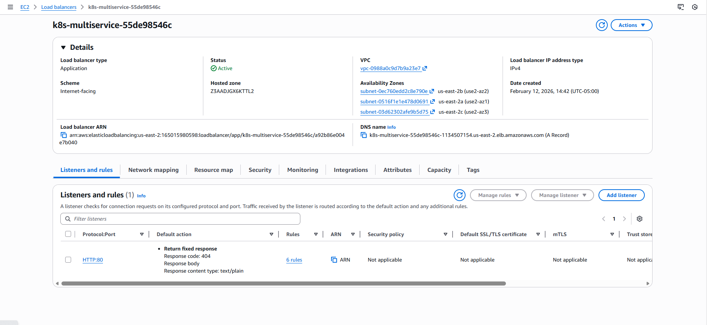
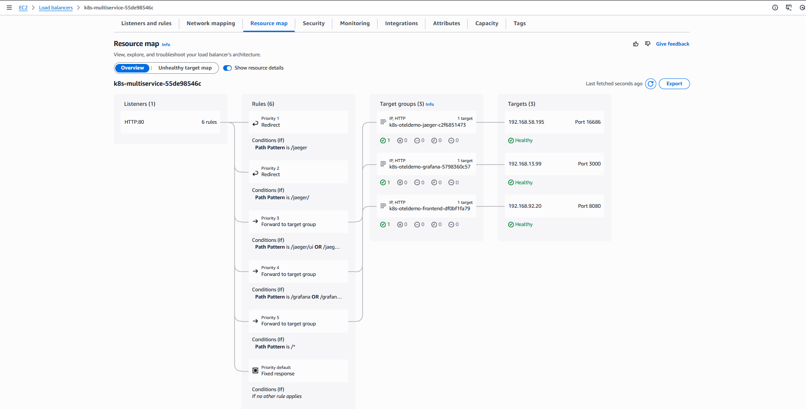

# Demo-04: Path-Based Routing - ALB Controller & Traefik

## Demo Overview

This demo consolidates multiple services behind a single load balancer using path-based routing. Instead of creating separate Ingress resources (and load balancers) for each service, you'll route different URL paths to different backend services, significantly reducing costs and simplifying infrastructure.

**What you'll do:**
- Create Ingress resources with multiple path rules
- Route `/` to frontend, `/jaeger` to Jaeger, `/grafana` to Grafana
- Handle path redirects for services with sub-path base URLs
- Compare ALB vs Traefik implementation
- Understand cost savings and trade-offs

## Prerequisites

**From Previous Demos:**
- ✅ Completed `00-otel-demo-app` - EKS Cluster installed and OTel Demo running
- ✅ Completed `01-aws-alb-controller` - ALB Controller installed
- ✅ Completed `02-traefik-controller` - Traefik installed
- ✅ Completed `03-expose-frontend` - Basic Ingress understanding

**Verify Prerequisites:**

### 1. Check OTel services exist
```bash
kubectl get svc -n otel-demo frontend-proxy jaeger grafana
```

**Expected: All 3 services present**
```
NAME             TYPE        CLUSTER-IP      EXTERNAL-IP   PORT(S)                                                                                                            AGE
frontend-proxy   ClusterIP   10.100.142.85   <none>        8080/TCP                                                                                                           6m39s
jaeger           ClusterIP   10.100.98.154   <none>        5775/UDP,...,16686/TCP,16685/TCP                                                                                    6m39s
grafana          ClusterIP   10.100.167.18   <none>        80/TCP                                                                                                             6m39s
```

### 2. Check endpoints
```bash
kubectl get endpoints frontend-proxy jaeger grafana -n otel-demo
```

**Expected: All 3 services have endpoints assigned**
```
NAME             ENDPOINTS                                                               AGE
frontend-proxy   192.168.37.147:8080                                                     7m46s
jaeger           192.168.90.66:4317,192.168.90.66:14268,192.168.90.66:4318 + 9 more...   7m46s
grafana          192.168.37.150:3000                                                     7m46s
```

### 3. Check controllers installed
```bash
kubectl get ingressclass
```

**Expected: alb and traefik**
```
NAME      CONTROLLER                      PARAMETERS   AGE
alb       ingress.k8s.aws/alb             <none>       10m
traefik   traefik.io/ingress-controller   <none>       6m39s
```

### 4. Check ALB Controller Deployment
```bash
kubectl get deployment aws-load-balancer-controller -n kube-system
```

**Expected: All ALB controller pods are READY**
```
NAME                           READY   UP-TO-DATE   AVAILABLE   AGE
aws-load-balancer-controller   2/2     2            2           16m
```

### 5. Check Traefik service
```bash
kubectl get svc traefik -n traefik
```

**Expected: NLB DNS assigned**
```
NAME      TYPE           CLUSTER-IP      EXTERNAL-IP                                                                   PORT(S)                      AGE
traefik   LoadBalancer   10.100.196.90   k8s-traefik-traefik-813afc9727-5cdd2e25a133d32c.elb.us-east-2.amazonaws.com   80:32195/TCP,443:30647/TCP   12m
```

---

## Demo Objectives

By the end of this demo, you will:

1. ✅ Create multi-path Ingress resources
2. ✅ Understand path matching and routing
3. ✅ Implement path redirects for services with sub-path base URLs
4. ✅ Compare ALB vs Traefik path handling
5. ✅ Understand cost savings from consolidation

## Architecture

### **Before (Demo-03 approach):**
```
3 Ingress resources → 3 ALBs → 3 Services
Cost: ~$50/month
```

### **After (This demo):**
```
3 Ingress resources (group.name) → 1 ALB → 3 Services (routed by path)
Cost: ~$17/month
```

### **Request Flow:**

```
User requests /              → ALB/Traefik routes to frontend-proxy:8080
User requests /grafana/*     → ALB/Traefik forwards as-is to grafana:80
User requests /jaeger        → ALB/Traefik redirects browser to /jaeger/ui/
User requests /jaeger/ui/*   → ALB/Traefik forwards as-is to jaeger:16686
```

## Understanding the Services

### **Service Path Requirements:**

| Service | Native Path | Ingress Path | Path Handling |
|---------|-------------|--------------|---------------|
| frontend-proxy | `/` | `/` | No change needed |
| grafana | `/grafana/` | `/grafana` | Already expects sub-path ✅ |
| jaeger | `/jaeger/ui/` | `/jaeger` | Redirect to `/jaeger/ui/` ⚠️ |

**Why Grafana works out of the box:**
- Grafana configured with `root_url: /grafana` in ConfigMap
- Expects requests on `/grafana/` sub-path
- No rewriting needed

**Why Jaeger needs a redirect:**
- Jaeger configured with `base_path: /jaeger/ui` in ConfigMap
- HTML contains `<base href="/jaeger/ui/">` for React router
- Browser URL must match `/jaeger/ui/` for React router to work correctly
- Server-side rewrite is insufficient - browser URL must physically change

## Directory Structure

```
04-path-based-routing/
├── README.md
└── src/
    ├── albc-ingress-frontend.yaml               # ALBC Ingress for frontend-proxy
    ├── albc-ingress-grafana.yaml                # ALBC Ingress for grafana
    ├── albc-ingress-jaeger.yaml                 # ALBC Ingress for jaeger (redirect)
    ├── albc-multi-path-ingress.yaml             # ALBC single Ingress (reference only)
    ├── traefik-stripprefix-middleware.yaml      # Traefik redirectRegex Middleware
    ├── traefik-multi-path-ingress.yaml          # Traefik basic Ingress (reference only)
    └── traefik-ingressroute-advanced.yaml       # Traefik IngressRoute (use this)
```

**Files to use in this demo:**

| Controller | Files |
|------------|-------|
| ALB | `albc-ingress-frontend.yaml`, `albc-ingress-grafana.yaml`, `albc-ingress-jaeger.yaml` |
| Traefik | `traefik-stripprefix-middleware.yaml`, `traefik-ingressroute-advanced.yaml` |

---

# Demo Instructions

## Part A: Path-Based Routing with ALB Controller

### Step 1: Understand Basic Concepts

#### Understand Grafana Health Check

- Grafana serves on `/grafana/` sub-path (`root_url: /grafana` in ConfigMap)
- ALB health check must use `/grafana/` (not `/`)
- Single Ingress cannot have different health check paths per service → use 3 separate Ingress with `group.name`

#### Understand Jaeger Path Redirect

- Jaeger configured with `base_path: /jaeger/ui` in ConfigMap
- HTML served with `<base href="/jaeger/ui/">` for React router
- Browser URL must be `/jaeger/ui/` for React router to work
- ALB redirect action changes browser URL correctly

#### Understand ALB Listener Rule Priority 

When using AWS Load Balancer Controller with a shared ALB (`alb.ingress.kubernetes.io/group.name`), **listener rule priority determines routing behavior**. ALB evaluates rules in ascending priority order (lowest number first) and stops at the first match.

  **Key Points**

  - ALB does **not** preserve YAML rule order.
  - Rules are sorted by:
    1. `alb.ingress.kubernetes.io/group.order`
    2. Path type (Exact before Prefix)
    3. Path specificity
  - A catch-all path (`/` or `/*`) can shadow more specific routes if evaluated first.
  - Redirect rules must be evaluated before catch-all routes to prevent backend handling.

  **Why `group.order` Was Required**

  In this setup:

  - Multiple Ingress resources share one ALB.
  - Each service requires a different health check path.
  - Services cannot be modified (OTel demo managed).

  Therefore, rule priority must be explicitly controlled using:

  ```
  alb.ingress.kubernetes.io/group.order: "<number>"
  ```

  Lower number = higher priority.

  `Final Rule Order (Expected)`

  1. **/jaeger** (Exact → Redirect)

  2. **/jaeger/** (Exact → Redirect)

  3. **/jaeger/ui** (Prefix → Forward)

  4. **/grafana** (Prefix → Forward)

  5. **/** (Prefix → Frontend catch-all)

  6. **Default rule**

  Why **/jaeger/ui** Appears After /jaeger, because ALB sorts:

  - Exact path rules before Prefix rules.

  - **/jaeger** and **/jaeger/** are Exact.

  - **/jaeger/ui** is Prefix.

  This ordering is correct and does not cause conflicts because Exact rules do not match subpaths.

####  ALB supports multiple path match types:**

| PathType | Behavior | Example |
|----------|----------|---------|
| `Prefix` | Matches prefix + everything after | `/jaeger/ui` matches `/jaeger/ui/search` |
| `Exact` | Matches exact path only | `/jaeger` matches `/jaeger` but not `/jaeger/` |


#### Understand Traefik IngressRoute Rule Priority

When using Traefik's IngressRoute CRD, **route priority determines which rule matches first**. Unlike ALB which evaluates rules in ascending numeric order (lowest first), Traefik evaluates routes in **descending priority order (highest number first)**.

**Key Points**

- Traefik does **not** use declaration order in YAML to determine priority.
- Priority is controlled by the explicit `priority` field on each route.
- If `priority` is not set, Traefik auto-calculates it based on rule character length — longer rules get higher priority. This is **unpredictable** for complex rules and should not be relied on.
- A catch-all route (`PathPrefix('/')`) will shadow all other routes if given a higher priority number.
- Redirect middleware must be on a higher priority route than the forward route to ensure correct browser URL behavior.

**Why Explicit `priority` Was Required**

In this setup:

- A single IngressRoute contains routes for frontend, grafana, and jaeger.
- Jaeger requires two separate routes: one for redirect (`/jaeger`, `/jaeger/`) and one for forwarding (`/jaeger/ui/*`).
- The catch-all frontend route (`/`) must be evaluated **last**.
- Without explicit priority, Traefik's auto-calculation could match `/jaeger/ui` before the redirect rule or match frontend catch-all first.

Therefore, priority must be explicitly set on every route:

```yaml
priority: <number>   # higher number = evaluated first
```

Higher number = higher priority. *(Opposite of ALB)*

**Final Route Priority Order (Expected)**

1. **/jaeger** and **/jaeger/** `priority: 20` (Exact Path match → Redirect to `/jaeger/ui/`)
2. **/jaeger/ui** `priority: 15` (Prefix → Forward to Jaeger)
3. **/grafana** `priority: 10` (Prefix → Forward to Grafana)
4. **/** `priority: 1` (Prefix → Frontend catch-all, evaluated last)

**Why `/jaeger/ui` appears after `/jaeger` redirect routes:**

- `Path('/jaeger') || Path('/jaeger/')` has priority 20 — evaluated first, sends browser redirect.
- `PathPrefix('/jaeger/ui')` has priority 15 — evaluated second, forwards UI/API/static asset requests as-is.
- This ordering is correct because `Path()` (exact) does not match `/jaeger/ui/*` subpaths, so there is no conflict.

#### Compare: ALB vs Traefik Priority

| Aspect | ALB | Traefik |
|--------|-----|---------|
| **Higher priority** | Lower number wins | Higher number wins |
| **Mechanism** | `group.order` annotation per Ingress | `priority` field per route |
| **Scope** | Across multiple Ingress files | Within single IngressRoute |
| **Default behavior** | Unpredictable without `group.order` | Unpredictable without `priority` |
| **Catch-all** | Highest `group.order` number (evaluated last) | Lowest `priority` number (evaluated last) |

---

### Step 2: Create Multi-Path Ingress (ALB)

**2.1 Files overview:**

`albc-ingress-frontend.yaml` - Routes `/` to frontend-proxy, health check `/`

`albc-ingress-grafana.yaml` - Routes `/grafana` to grafana, health check `/grafana/`

`albc-ingress-jaeger.yaml` - Two path rules:
- `/jaeger` and `/jaeger/` (Exact) → redirect action to `/jaeger/ui/`
- `/jaeger/ui` (Prefix) → forward to jaeger:16686

**Key annotations explained:**

`alb.ingress.kubernetes.io/group.name: multi-service`
- All 3 Ingress resources share the same ALB (single cost)
- Each can have its own health check path annotation

`alb.ingress.kubernetes.io/actions.jaeger-redirect`
- Defines a redirect action
- Returns HTTP 307 to browser with `Location: /jaeger/ui/`
- Browser follows redirect → URL changes → React router works

`alb.ingress.kubernetes.io/group.order`
- Listener rules priority controlled via group.order
- Lower number evaluated first
- Catch-all / must always have highest order number

**2.2 Apply 3 Ingress:**

```bash
cd 04-path-based-routing/src

kubectl apply -f albc-ingress-frontend.yaml
kubectl apply -f albc-ingress-grafana.yaml
kubectl apply -f albc-ingress-jaeger.yaml
(OR)
ls albc-ingress* | xargs -n 1 kubectl apply -f
```

**2.3 Wait for ALB provisioning:**

```bash
kubectl get ingress -n otel-demo -w
```

**Expected output (all 3 share same ALB DNS):**
```
NAME           CLASS   HOSTS   ADDRESS                                                              PORTS   AGE
frontend-alb   alb     *       k8s-multiservice-331be209cc-1940602464.us-east-2.elb.amazonaws.com   80      29m
grafana-alb    alb     *       k8s-multiservice-331be209cc-1940602464.us-east-2.elb.amazonaws.com   80      29m
jaeger-alb     alb     *       k8s-multiservice-331be209cc-1940602464.us-east-2.elb.amazonaws.com   80      29m
```

Wait for ADDRESS field to populate (~2-3 minutes).

**Note:** All 3 Ingress share the same ALB

---

### Step 3: Verify ALB Listener Rules

**3.1 Check ALB Listeners**



**3.2 Check ALB Rules**


**3.3 Check Target Groups**


**3.4 Check Resource Map**



**Note:** All targets should show **Healthy**

---

### Step 4: Test Path Routing (ALB)

```
ALB_DNS=$(kubectl get ingress frontend-alb -n otel-demo \
  -o jsonpath='{.status.loadBalancer.ingress[0].hostname}')
```

### Frontend
```
curl -I http://$ALB_DNS/
```
**Expected:** HTTP/1.1 200 OK

### Grafana
```
curl -I http://$ALB_DNS/grafana/
```
**Expected:** HTTP/1.1 200 OK

### Jaeger redirect
```
curl -I http://$ALB_DNS/jaeger/
&
curl -I http://$ALB_DNS/jaeger
```
**Expected:** 

HTTP/1.1 307 Temporary Redirect

Location: http://.../jaeger/ui/

### Jaeger UI (after redirect)
```
curl -I http://$ALB_DNS/jaeger/ui/
```
**Expected:** HTTP/1.1 200 OK

### Jaeger API
```
curl -s http://$ALB_DNS/jaeger/ui/api/services
```
**Expected:** {"data":["frontend","checkout",...],"errors":null}


**In browser:**
- `http://$ALB_DNS/` → Frontend app
- `http://$ALB_DNS/grafana/` → Grafana dashboards
- `http://$ALB_DNS/jaeger/` → Redirects to `/jaeger/ui/`, shows Jaeger UI
- `http://$ALB_DNS/jaeger` → Redirects to `/jaeger/ui/`, shows Jaeger UI

---

## Part B: Path-Based Routing with Traefik

### Step 5: Understand Traefik Middleware

Traefik uses **Middleware** CRDs for path manipulation:

| Middleware | Behaviour |
|------------|-----------|
| `stripPrefix` | Removes path prefix (server-side, browser URL unchanged) |
| `replacePathRegex` | Rewrites path via regex (server-side, browser URL unchanged) |
| `redirectRegex` | Redirects browser via regex (browser URL changes) |

**Note:** For Jaeger, `redirectRegex` is required because the React router needs the browser URL to be `/jaeger/ui/`.

---

### Step 6: Apply Middleware and IngressRoute

**6.1 Apply Middleware:**

```bash
kubectl apply -f traefik-stripprefix-middleware.yaml
kubectl get middleware -n otel-demo
```
**Expected:**
```
NAME              AGE
jaeger-redirect   10s
```

**6.2 Apply IngressRoute:**

```bash
kubectl apply -f traefik-ingressroute-advanced.yaml
kubectl get ingressroute -n otel-demo
```
**Expected:**
```
NAME                 AGE
multi-path-advanced  10s
```

**6.3 Verify in Traefik Dashboard & Listener & Rules**

**6.3.1 Check `HTTP Routers`in Traefik Dashboard**

```bash
kubectl port-forward -n traefik deployment/traefik 9000:9000
```

Open: `http://localhost:9000/dashboard/`

Navigate to **HTTP → Routers** → click `multi-path-advanced`:
- 4 routes with correct priorities (1, 10, 15, 20)
- Middleware `jaeger-redirect` attached to `/jaeger` route only
- All routes show **Success** status


---

### Step 7: Test Path Routing (Traefik)

```bash
TRAEFIK_DNS=$(kubectl get svc traefik -n traefik \
  -o jsonpath='{.status.loadBalancer.ingress[0].hostname}')
```
### Frontend
```
curl -I http://$TRAEFIK_DNS/
```
**Expected:** HTTP/1.1 200 OK

### Grafana
```
curl -I http://$TRAEFIK_DNS/grafana/
```
**Expected:** HTTP/1.1 200 OK

### Jaeger redirect
```
curl -I http://$TRAEFIK_DNS/jaeger/
&
curl -I http://$TRAEFIK_DNS/jaeger
```
**Expected:** 

HTTP/1.1 307 Temporary Redirect

Location: http://.../jaeger/ui/

### Jaeger UI (after redirect)
```
curl -I http://$TRAEFIK_DNS/jaeger/ui/
```
**Expected:** HTTP/1.1 200 OK

### Jaeger API
```
curl -s http://$TRAEFIK_DNS/jaeger/ui/api/services
```
**Expected:** {"data":["frontend","checkout",...],"errors":null}


**In browser:**
- `http://$TRAEFIK_DNS/` → Frontend app
- `http://$TRAEFIK_DNS/grafana/` → Grafana dashboards
- `http://$TRAEFIK_DNS/jaeger/` → Redirects to `/jaeger/ui/`, shows Jaeger UI
- `http://$TRAEFIK_DNS/jaeger` → Redirects to `/jaeger/ui/`, shows Jaeger UI

---

## Part C: Comparison and Best Practices

### Step 8: Compare ALB vs Traefik Path Handling

| Aspect | ALB Controller | Traefik |
|--------|----------------|---------|
| **Path Redirect** | `actions.<n>` annotation with redirect config | `redirectRegex` Middleware CRD |
| **Configuration** | JSON annotations in Ingress | Separate Middleware resource |
| **Per-path middleware** | Via separate Ingress + group.name | Native in IngressRoute routes |
| **Debugging** | AWS Console Resource Map | Traefik Dashboard (visual) |
| **Performance** | AWS-native (fast) | Extra hop through pod |
| **Cost** | 1 ALB (~$17/month) | 1 NLB (~$17/month) |

---

### Step 9: Cost Analysis

| Approach | Load Balancers | Monthly Cost |
|----------|----------------|--------------|
| 3 separate Ingress (ALB) | 3 ALBs | ~$50 |
| 3 separate Ingress (Traefik) | 1 NLB | ~$17 |
| 3 Ingress with group.name (ALB) | 1 ALB | ~$17 |
| IngressRoute (Traefik) | 1 NLB | ~$17 |

**Savings with path-based routing + group.name:** $50 → $17 (66% reduction)

---

## Validation Checklist

- [ ] All 3 ALB Ingress created and share same ALB DNS
- [ ] All targets Healthy in AWS Console
- [ ] Frontend `/` returns 200
- [ ] Grafana `/grafana/` returns 200
- [ ] Jaeger `/jaeger/` returns 307 → redirects to `/jaeger/ui/`
- [ ] Jaeger UI loads correctly in browser
- [ ] Jaeger API `/jaeger/ui/api/services` returns service list JSON
- [ ] Traefik IngressRoute and Middleware applied
- [ ] All paths working via Traefik NLB

---

## Cleanup

```bash
# ALB
kubectl delete ingress frontend-alb grafana-alb jaeger-alb -n otel-demo

# Traefik
kubectl delete ingressroute multi-path-advanced -n otel-demo
kubectl delete middleware jaeger-redirect -n otel-demo
```

---

## What You Learned

- ✅ Created multi-path routing consolidating 3 services behind 1 load balancer
- ✅ Used `group.name` annotation to share 1 ALB across multiple Ingress resources
- ✅ Understood why per-service health check paths require separate Ingress resources
- ✅ Understood why Jaeger needs a redirect (not rewrite) due to React router + base_path
- ✅ Compared ALB redirect actions vs Traefik redirectRegex Middleware
- ✅ Achieved 66% cost reduction via path-based routing

---

## Lessons Learned

This section captures how the configuration evolved through troubleshooting.

### L1: Single Ingress → 3 Separate Ingress (ALB)

**Problem:** Single Ingress with all 3 paths → Grafana unhealthy (HTTP 301 on health check)

**Why:** ALB health check annotation applies globally. Grafana needs `/grafana/` health check, frontend needs `/`. Cannot set per-service health check in one Ingress.

**Fix:** Split into 3 Ingress resources using `alb.ingress.kubernetes.io/group.name: multi-service`. All 3 share 1 ALB but each has independent annotations.

---

### L2: Grafana Port 1 Bug

**Problem:** ALB Target Group registered Grafana on port 1 (unhealthy)

**Why:** Ingress specified service port `80`. Grafana service uses named targetPort `grafana` → port `3000`. ALB Controller failed to resolve named port with `target-type: ip`.

**Fix:** Specify actual service port `80` explicitly (not named port) or pod port `3000` directly.

---

### L3: Jaeger Path - Server Rewrite vs Browser Redirect

**Problem:** Multiple middleware approaches failed (`stripPrefix`, `replacePathRegex`, ALB `RewriteConfig`)

**Root Cause (discovered via browser DevTools):**
- Jaeger HTML contains `<base href="/jaeger/ui/">`
- React router checks browser URL against base href
- Server-side rewrite changes path sent to Jaeger but **browser URL stays `/jaeger/`**
- Mismatch between browser URL `/jaeger/` and base href `/jaeger/ui/` → React shows "Page not found"

**Fix:** Use **browser redirect** (307) → browser URL physically changes to `/jaeger/ui/` → React router matches → UI loads correctly.

| Approach | Browser URL | Result |
|----------|-------------|--------|
| `replacePathRegex` | stays `/jaeger/` | ❌ React mismatch |
| `redirectRegex` / ALB redirect | changes to `/jaeger/ui/` | ✅ Works |

---

### L4: IngressRoute Routes Required for Traefik

**Problem:** Single route `PathPrefix(/jaeger)` with redirect middleware → after redirect to `/jaeger/ui/`, no route matched → blank page

**Fix:** Two separate routes needed:
- `Path(/jaeger) || Path(/jaeger/)` with `redirectRegex` middleware (priority 20)
- `PathPrefix(/jaeger/ui)` without middleware, forward as-is (priority 15)

---

## Troubleshooting

**Grafana target unhealthy:**
```bash
# Verify health check path annotation
kubectl get ingress grafana-alb -n otel-demo -o yaml | grep healthcheck-path
# Expected: /grafana/
```

**Jaeger shows blank page:**
```bash
# Check redirect is happening (must be 307, not 200)
curl -I http://$ALB_DNS/jaeger/
# Must see: HTTP/1.1 307 Temporary Redirect
#           Location: .../jaeger/ui/

# If 200 (no redirect), check action annotation
kubectl get ingress jaeger-alb -n otel-demo -o yaml | grep -A 10 actions
```

**Traefik Jaeger blank page:**
```bash
# Verify middleware type is redirectRegex (not replacePathRegex)
kubectl get middleware jaeger-redirect -n otel-demo -o yaml | grep -A 5 spec
```

**Path conflicts (wrong service responding):**
```bash
# Check ALB rule priorities
aws elbv2 describe-rules --listener-arn $LISTENER_ARN --output table

# Check Traefik route priorities
# Dashboard → HTTP → Routers → check Priority column
kubectl port-forward -n traefik svc/traefik 9000:9000
```

---

## Next Steps

**Demo 1.5: Host-Based Routing**
- Route different hostnames to different services
- Use custom domains (`frontend.example.com`, `jaeger.example.com`)
- Combine host + path routing