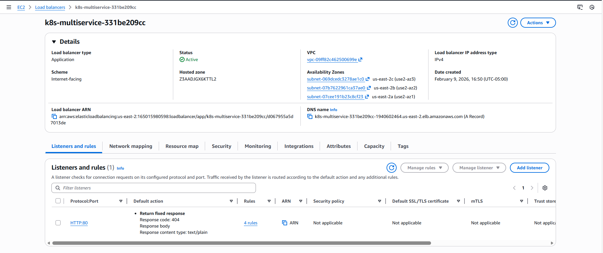
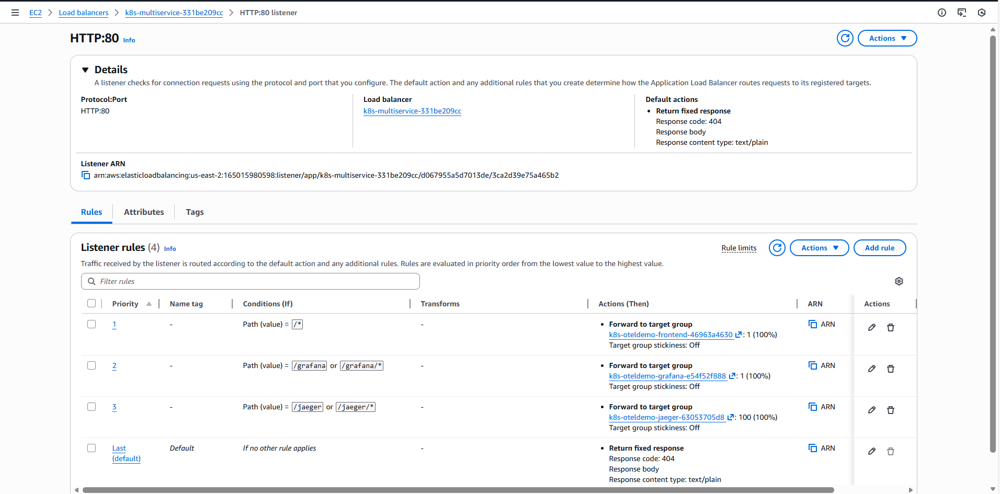
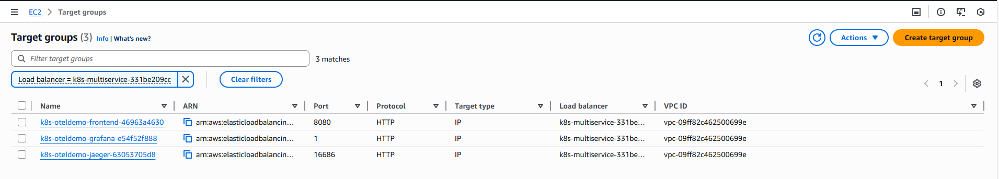
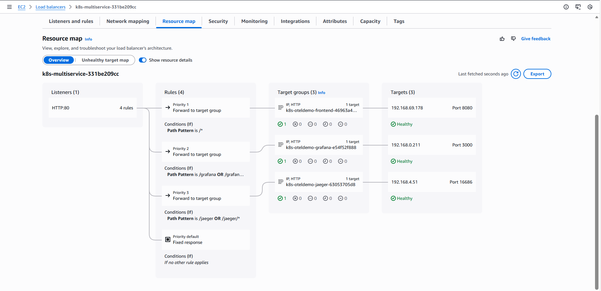

# Demo-04: Path-Based Routing

## Demo Overview

This demo consolidates multiple services behind a single load balancer using path-based routing. Instead of creating separate Ingress resources (and load balancers) for each service, you'll route different URL paths to different backend services, significantly reducing costs and simplifying infrastructure.

**What you'll do:**
- Create a single Ingress with multiple path rules
- Route `/` to frontend, `/jaeger` to Jaeger, `/grafana` to Grafana
- Handle path rewriting for services that don't expect the prefix
- Compare ALB vs Traefik implementation
- Understand cost savings and trade-offs

## Prerequisites

**From Previous Demos:**
- ✅ Completed `00-otel-demo-app` - EKS Cluster installed and OTel Demo running
- ✅ Completed `01-aws-alb-controller` - ALB Controller installed
- ✅ Completed `02-traefik-controller` - Traefik installed
- ✅ Completed `03-expose-frontend` - Basic Ingress understanding

**Verify Prerequisites:**

### 1.Check OTel services exist
```
kubectl get svc -n otel-demo frontend-proxy jaeger grafana
```

**Expected: All 3 services present**
```
NAME             TYPE        CLUSTER-IP      EXTERNAL-IP   PORT(S)                                                                                                            AGE
frontend-proxy   ClusterIP   10.100.142.85   <none>        8080/TCP                                                                                                           6m39s
jaeger           ClusterIP   10.100.98.154   <none>        5775/UDP,5778/TCP,6831/UDP,6832/UDP,9411/TCP,14250/TCP,14267/TCP,14268/TCP,4317/TCP,4318/TCP,16686/TCP,16685/TCP   6m39s
grafana          ClusterIP   10.100.167.18   <none>        80/TCP                                                                                                             6m39s
```

### 2.Check endpoints
```
kubectl get endpoints frontend-proxy jaeger grafana -n otel-demo
```

**Expected: All 3 services has endpoints assigned**
```
NAME             ENDPOINTS                                                               AGE
frontend-proxy   192.168.37.147:8080                                                     7m46s
jaeger           192.168.90.66:4317,192.168.90.66:14268,192.168.90.66:4318 + 9 more...   7m46s
grafana          192.168.37.150:3000                                                     7m46s
```

### 3.Check controllers installed
```
kubectl get ingressclass
```

**Expected: alb and traefik**
```
NAME      CONTROLLER                      PARAMETERS   AGE
alb       ingress.k8s.aws/alb             <none>       10m
traefik   traefik.io/ingress-controller   <none>       6m39s
```

### 4.Check ALB Controller Deployment
```
kubectl get deployment aws-load-balancer-controller -n kube-system
```

**Expected: All ALB controller pods are READY**
```
NAME                           READY   UP-TO-DATE   AVAILABLE   AGE
aws-load-balancer-controller   2/2     2            2           16m
```

### 5.Check Traefik service
```
kubectl get svc traefik -n traefik
```

**Expected: NLB DNS assinged**
```
NAME      TYPE           CLUSTER-IP      EXTERNAL-IP                                                                   PORT(S)                      AGE
traefik   LoadBalancer   10.100.196.90   k8s-traefik-traefik-813afc9727-5cdd2e25a133d32c.elb.us-east-2.amazonaws.com   80:32195/TCP,443:30647/TCP   12m
```


## Demo Objectives

By the end of this demo, you will:

1. ✅ Create multi-path Ingress resources
2. ✅ Understand path matching and routing
3. ✅ Implement path rewriting/stripping
4. ✅ Compare ALB vs Traefik path handling
5. ✅ Understand cost savings from consolidation

## Architecture

### **Before (Demo-03 approach):**
```
3 Ingress resources → 3 ALBs → 3 Services
Cost: ~$50/month
```

### **After (This demo):**
```
1 Ingress resource → 1 ALB → 3 Services (routed by path)
Cost: ~$17/month
```

### **Request Flow:**

```
User requests /           → ALB routes to frontend-proxy:8080
User requests /jaeger/*   → ALB strips /jaeger, routes to jaeger:16686
User requests /grafana/*  → ALB forwards as-is to grafana:80
```

## Understanding the Services

### **Service Path Requirements:**

| Service | Native Path | Ingress Path | Path Handling |
|---------|-------------|--------------|---------------|
| frontend-proxy | `/` | `/` | No change needed |
| grafana | `/grafana/` | `/grafana` | Already expects sub-path ✅ |
| jaeger | `/` | `/jaeger` | Needs `/jaeger` stripped ⚠️ |

**Why Grafana works out of the box:**
- Grafana configured with `root_url: /grafana` in ConfigMap
- Expects requests like `/grafana/dashboard`
- No rewriting needed

**Why Jaeger needs rewriting:**
- Jaeger serves on `/` natively
- User requests `/jaeger/search`
- Jaeger expects `/search`
- Must strip `/jaeger` prefix before forwarding

## Directory Structure

```
04-path-based-routing/
├── README.md
└── src/
    ├── albc-ingress-frontend.yaml               # ALBC Ingress for **frontend-proxy**
    ├── albc-ingress-grafana.yaml                # ALBC Ingress for **grafana**
    ├── albc-ingress-jaedger.yaml                # ALBC Ingress for **jaeger**
    ├── albc-multi-path-ingress.yaml             # ALBC Ingress for all 3 services
    ├── traefik-stripprefix-middleware.yaml      # Traefik Middleware
    ├── traefik-multi-path-ingress.yaml          # Traefik basic Ingress
    └── traefik-ingressroute-advanced.yaml       # Traefik IngressRoute (advanced)
```
**Note** : `Architecture Decision: Single vs Multiple Ingress Resources`

**Files to use in this demo for albc**
```
    ├── albc-ingress-frontend.yaml               # ALBC Ingress for **frontend-proxy**
    ├── albc-ingress-grafana.yaml                # ALBC Ingress for **grafana**
    ├── albc-ingress-jaedger.yaml                # ALBC Ingress for **jaeger**
```

**Initial Approach (1 Ingress):**
- All 3 paths in one Ingress resource (`albc-multi-path-ingress.yaml`)
- **Limitation:** ALB Controller annotations apply globally to entire Ingress
- Cannot set different health check paths per backend service

**Final Approach (3 Ingress with group.name):**
- Separate Ingress per service, each with custom health check path
- `alb.ingress.kubernetes.io/group.name: multi-service` annotation
- **Benefit:** All 3 Ingress share the same ALB (single cost)
- **Flexibility:** Per-service annotations (health checks, timeouts, TLS)
- **Trade-off:** Slightly more YAML files, but essential for services with different health check requirements.


# Demo Instructions

## Part A: Path-Based Routing with ALB Controller

### Step 0: Understand Grafana Health Check Configuration

**Initial Problem:**
- Grafana configured with `root_url: /grafana` (expects requests on `/grafana` sub-path)
- ALB health check defaulted to `/` (root path)
- Grafana responded with **HTTP 301 Redirect** to `/grafana/`
- ALB marked target as **Unhealthy** (expected 200, received 301)

**Solution:**
- Single Ingress cannot have different health check paths per service
- Split into 3 separate Ingress resources using `group.name` annotation
- Each Ingress specifies appropriate health check path:
  - Frontend: `/` (default)
  - Grafana: `/grafana/`
  - Jaeger: `/`
- All 3 share the same ALB (cost-efficient)

**Result:** All targets now report **Healthy** with correct health check responses.


### Step 1: Understand ALB Path Matching

**1.1 ALB supports multiple path match types:**

| PathType | Behavior | Example |
|----------|----------|---------|
| `Prefix` | Matches prefix + everything after | `/jaeger` matches `/jaeger/search` |
| `Exact` | Matches exact path only | `/api` matches `/api` but not `/api/v1` |

**1.2 Path priority in ALB:**

When multiple paths could match, ALB uses this order:
1. Exact matches first
2. Longer prefixes before shorter ones
3. `/jaeger/api` evaluated before `/jaeger`

---

### Step 2: Create Multi-Path Ingress (ALB)

**2.1 Review the Ingress manifest:**

Create `albc-ingress-frontend.yaml`:
Create `albc-ingress-grafana.yaml`:
Create `albc-ingress-jaedger.yaml`:


**Key annotations explained:**

**`alb.ingress.kubernetes.io/group.name: multi-service`**
- Same group name here makes them to use the same ALB

**`alb.ingress.kubernetes.io/actions.jaeger-rewrite`:**
- Defines a custom action named `jaeger-rewrite`
- Forwards to `jaeger:16686` service
- Strips `/jaeger` prefix via `RewriteConfig`

**Backend `service.name: jaeger-rewrite`:**
- This is NOT a real service
- It's a reference to the annotation action
- ALB Controller interprets this as "use the action"

**2.2 Apply 3 Ingress:**

```bash
ls albc-ingress* | xargs -n 1 kubectl apply -f
```

**2.3 Wait for ALB provisioning:**

```bash
kubectl get ingress -n otel-demo -w
```

**Expected output:**
```
NAME           CLASS   HOSTS   ADDRESS                                                              PORTS   AGE
frontend-alb   alb     *       k8s-multiservice-331be209cc-1940602464.us-east-2.elb.amazonaws.com   80      29m
grafana-alb    alb     *       k8s-multiservice-331be209cc-1940602464.us-east-2.elb.amazonaws.com   80      29m
jaeger-alb     alb     *       k8s-multiservice-331be209cc-1940602464.us-east-2.elb.amazonaws.com   80      29m
```

Wait for ADDRESS field to populate (~2-3 minutes) for all 3 services.All 3 services uses the same ALB

---

### Step 3: Verify ALB Listener Rules

**3.1 Check ALB Listeners**




**3.2 Check ALB rules**



**Key Observations**
- you have 3+1 rules ( 3 rules as per your ingress definition + 1 default rules )
-----------------------------------------
|            DescribeRules              |
+----------+---------------------------+
| Priority | Path                      |
+----------+---------------------------+
|  1       |  /grafana*                |
|  2       |  /jaeger*                 |
|  3       |  /*                       |
|  default | Return Response code: 404 |
+----------+---------------------------+


**3.3 Check Target Groups**




**3.4 Check Resource Map**



**Key Observations**
- check all the targets are healthy

### Step 3.1: Verify ALB Listener - CLI

**3.1 Get ALB DNS:**

```bash
ALB_DNS=$(kubectl get ingress multi-path-alb -n otel-demo -o jsonpath='{.status.loadBalancer.ingress[0].hostname}')
echo "ALB DNS: $ALB_DNS"
```

**3.2 Check ALB rules in AWS Console:**

```bash
# Get ALB ARN
ALB_ARN=$(aws elbv2 describe-load-balancers \
  --query "LoadBalancers[?Type=='application' && contains(DNSName, '$(echo $ALB_DNS | cut -d'-' -f1,2)')].LoadBalancerArn" \
  --output text)

# Get listener ARN (HTTP:80)
LISTENER_ARN=$(aws elbv2 describe-listeners \
  --load-balancer-arn $ALB_ARN \
  --query 'Listeners[?Port==`80`].ListenerArn' \
  --output text)

# List all rules
aws elbv2 describe-rules --listener-arn $LISTENER_ARN \
  --query 'Rules[].{Priority:Priority,Path:Conditions[?Field==`path-pattern`].Values}' \
  --output table
```

**Expected output:**
```
-----------------------------------------
|            DescribeRules              |
+----------+---------------------------+
| Priority | Path                      |
+----------+---------------------------+
|  1       |  /grafana*                |
|  2       |  /jaeger*                 |
|  default |  /*                       |
+----------+---------------------------+
```

**3.3 Verify target groups:**

```bash
aws elbv2 describe-target-groups \
  --load-balancer-arn $ALB_ARN \
  --query 'TargetGroups[].{Name:TargetGroupName,Port:Port,Protocol:Protocol}' \
  --output table
```

You should see 3 target groups (frontend-proxy, grafana, jaeger).

---

### Step 4: Test Path Routing

**4.1 Get ALB DNS:**

```bash
ALB_DNS=$(kubectl get ingress frontend-alb -n otel-demo -o jsonpath='{.status.loadBalancer.ingress[0].hostname}')
echo "ALB DNS: $ALB_DNS"
```

**4.2 Test frontend (root path):**

```bash
curl -I http://$ALB_DNS/
```

**Expected:**
```
HTTP/1.1 200 OK
Content-Type: text/html
```

**4.3 Test Grafana:**

```bash
curl -I http://$ALB_DNS/grafana/
```

**Expected:**
```
HTTP/1.1 200 OK
Content-Type: text/html
```

**In browser:**
```bash
echo "Open: http://$ALB_DNS/grafana/"
```

Should show Grafana dashboards.

**4.4 Test Jaeger:**

```bash
curl -I http://$ALB_DNS/jaeger/
```

**Expected:**
```
HTTP/1.1 200 OK
Content-Type: text/html
```

**In browser:**
```bash
echo "Open: http://$ALB_DNS/jaeger/"
```

Should show Jaeger UI.

**4.5 Test Jaeger search (path rewriting verification):**

```bash
curl http://$ALB_DNS/jaeger/api/services
```

**Expected:**
```json
{"data":["frontend","cartservice","checkoutservice",...]}
```

This proves the path rewrite works:
- User requested: `/jaeger/api/services`
- ALB stripped `/jaeger`, forwarded: `/api/services`
- Jaeger responded correctly

---

### Step 5: Troubleshooting ALB Path Rewriting

**If Jaeger shows 404 errors:**

**5.1 Check the action annotation syntax:**

```bash
kubectl get ingress multi-path-alb -n otel-demo -o yaml | grep -A 20 "actions.jaeger-rewrite"
```

Ensure JSON is valid (no trailing commas, proper brackets).

**5.2 Check ALB Controller logs:**

```bash
kubectl logs -n kube-system deployment/aws-load-balancer-controller | grep -i "jaeger\|rewrite"
```

Look for errors in parsing the action.

**5.3 Verify the backend reference:**

The backend must reference the action name:
```yaml
backend:
  service:
    name: jaeger-rewrite  # Must match annotation name
    port:
      name: use-annotation  # Special value
```

---

## Part B: Path-Based Routing with Traefik

### Step 6: Understand Traefik Middleware

Traefik uses **Middleware** CRDs for path manipulation:

**Middleware types:**
- `StripPrefix` - Removes path prefix
- `AddPrefix` - Adds path prefix
- `ReplacePath` - Replaces entire path
- `RedirectRegex` - Redirects based on regex

For Jaeger, we need `StripPrefix` to remove `/jaeger`.

---

### Step 7: Create Middleware for Path Stripping

**7.1 Create the Middleware:**

Create `traefik-stripprefix-middleware.yaml`:

```yaml
apiVersion: traefik.io/v1alpha1
kind: Middleware
metadata:
  name: jaeger-stripprefix
  namespace: otel-demo
spec:
  stripPrefix:
    prefixes:
      - /jaeger
    forceSlash: false
```

**What this does:**
- Removes `/jaeger` from the request path
- `/jaeger/api/services` → `/api/services`
- `forceSlash: false` - Don't add trailing slash

**7.2 Apply the Middleware:**

```bash
kubectl apply -f traefik-stripprefix-middleware.yaml
```

**7.3 Verify Middleware created:**

```bash
kubectl get middleware -n otel-demo
```

**Expected:**
```
NAME                  AGE
jaeger-stripprefix    10s
```

---

### Step 8: Create Multi-Path Ingress (Traefik)

**8.1 Create the Ingress manifest:**

Create `traefik-multi-path-ingress.yaml`:

**Note:** The middleware annotation applies to **ALL paths** in this Ingress. For per-path middleware, use IngressRoute CRD instead (advanced).

**8.2 Apply the Ingress:**

```bash
kubectl apply -f traefik-multi-path-ingress.yaml
```

**8.3 Check Traefik Dashboard:**

```bash
kubectl port-forward -n traefik svc/traefik 9000:9000
```

Open: http://localhost:9000/dashboard/

**Navigate to HTTP → Routers:**
- Find `otel-demo-multi-path-traefik-...`
- Verify 3 paths: `/`, `/grafana`, `/jaeger`
- Check middleware attached

---

### Step 9: Test Traefik Path Routing

**9.1 Get Traefik NLB hostname:**

```bash
TRAEFIK_DNS=$(kubectl get svc traefik -n traefik -o jsonpath='{.status.loadBalancer.ingress[0].hostname}')
echo "Traefik NLB: $TRAEFIK_DNS"
```

**9.2 Test frontend:**

```bash
curl -I http://$TRAEFIK_DNS/
```

**9.3 Test Grafana:**

```bash
curl -I http://$TRAEFIK_DNS/grafana/
```

**9.4 Test Jaeger:**

```bash
curl -I http://$TRAEFIK_DNS/jaeger/
```

**9.5 Test Jaeger API (path stripping verification):**

```bash
curl http://$TRAEFIK_DNS/jaeger/api/services
```

Should return service list JSON.

---

### Step 10: Advanced - Per-Path Middleware with IngressRoute

For more control, use Traefik's IngressRoute CRD (optional, more advanced):

Create `multi-path-ingressroute.yaml`:

```yaml
apiVersion: traefik.io/v1alpha1
kind: IngressRoute
metadata:
  name: multi-path-advanced
  namespace: otel-demo
spec:
  entryPoints:
    - web
  routes:
  # Route 1: Frontend (no middleware)
  - match: PathPrefix(`/`)
    kind: Rule
    priority: 1
    services:
    - name: frontend-proxy
      port: 8080
  
  # Route 2: Grafana (no middleware)
  - match: PathPrefix(`/grafana`)
    kind: Rule
    priority: 10
    services:
    - name: grafana
      port: 80
  
  # Route 3: Jaeger (with middleware)
  - match: PathPrefix(`/jaeger`)
    kind: Rule
    priority: 10
    middlewares:
    - name: jaeger-stripprefix
    services:
    - name: jaeger
      port: 16686
```

**Benefits:**
- Per-path middleware control
- Explicit priority ordering
- More powerful matching rules

---

## Part C: Comparison and Best Practices

### Step 11: Compare ALB vs Traefik Path Handling

| Aspect | ALB Controller | Traefik |
|--------|----------------|---------|
| **Path Rewriting** | JSON annotation (complex) | Middleware CRD (cleaner) |
| **Configuration** | Annotations in Ingress | Separate Middleware resource |
| **Flexibility** | Limited to ALB features | Highly extensible |
| **Debugging** | AWS Console + logs | Traefik Dashboard (visual) |
| **Performance** | AWS-native (fast) | Extra hop through pod |
| **Cost** | 1 ALB (~$17/month) | 1 NLB (~$17/month) |

---

### Step 12: Cost Analysis

**Scenario: Expose 3 services**

| Approach | Load Balancers | Monthly Cost |
|----------|----------------|--------------|
| 3 separate Ingress (ALB) | 3 ALBs | ~$50 |
| 3 separate Ingress (Traefik) | 1 NLB | ~$17 |
| 1 multi-path Ingress (ALB) | 1 ALB | ~$17 |
| 1 multi-path Ingress (Traefik) | 1 NLB | ~$17 |

**Savings with path-based routing:**
- ALB: $50 → $17 (66% reduction)
- Traefik: Already consolidated

---

### Step 13: Path Routing Best Practices

**1. Path Priority:**
- Put more specific paths first
- Use `Exact` for API endpoints
- Use `Prefix` for UI routes

**2. Path Rewriting:**
- Avoid if possible (configure service to expect prefix)
- Document clearly when required
- Test thoroughly

**3. Health Checks:**
- Use root path (`/`) for health checks
- Don't use rewritten paths for health checks

**4. Path Conflicts:**
```yaml
# Bad: Conflicts
- path: /api
- path: /api/v1  # Never matches (shadowed by /api)

# Good: Specific first
- path: /api/v1  # Matches first (more specific)
- path: /api     # Matches if v1 doesn't
```

---

## Validation Checklist

Before proceeding, verify:

- [ ] Multi-path ALB Ingress created and working
- [ ] All 3 paths accessible via ALB: `/`, `/grafana`, `/jaeger`
- [ ] Traefik Middleware created
- [ ] Multi-path Traefik Ingress created and working
- [ ] All 3 paths accessible via Traefik
- [ ] Path rewriting works for Jaeger on both
- [ ] Understand cost savings from consolidation

---

## Cleanup

**Remove multi-path Ingress resources:**

```bash
kubectl delete ingress multi-path-alb -n otel-demo
kubectl delete ingress multi-path-traefik -n otel-demo
kubectl delete middleware jaeger-stripprefix -n otel-demo
```

**Verify cleanup:**

```bash
kubectl get ingress -n otel-demo
kubectl get middleware -n otel-demo
```

---

## What You Learned

In this demo, you:
- ✅ Created multi-path Ingress resources consolidating 3 services
- ✅ Implemented path-based routing with both ALB and Traefik
- ✅ Handled path rewriting for services that don't expect the prefix
- ✅ Compared path manipulation approaches (annotations vs Middleware)
- ✅ Understood 66% cost savings from consolidation
- ✅ Learned best practices for path priority and conflicts

**Key Insight:**
Path-based routing is **essential for cost optimization** when exposing multiple services. Both controllers support it, but with different mechanisms:
- **ALB:** Annotations (tightly coupled, AWS-specific)
- **Traefik:** Middleware CRDs (reusable, portable)

---

## Next Steps

**Demo 1.5: Host-Based Routing**
- Route different hostnames to different services
- Use custom domains (frontend.example.com, jaeger.example.com)
- Combine host + path routing

---

## Troubleshooting

**Jaeger 404 on ALB:**
```bash
# Check action annotation
kubectl describe ingress multi-path-alb -n otel-demo | grep -A 10 actions

# Verify JSON is valid
kubectl get ingress multi-path-alb -n otel-demo -o jsonpath='{.metadata.annotations}' | jq
```

**Traefik path not stripping:**
```bash
# Check middleware exists
kubectl get middleware jaeger-stripprefix -n otel-demo

# Check Traefik logs
kubectl logs -n traefik deployment/traefik | grep -i middleware

# Verify annotation references correct middleware
kubectl get ingress multi-path-traefik -n otel-demo -o yaml | grep middlewares
```

**Path conflicts (wrong service responding):**
```bash
# Check path priority in ALB rules
aws elbv2 describe-rules --listener-arn $LISTENER_ARN

# Check Traefik router priorities
kubectl port-forward -n traefik svc/traefik 9000:9000
# Dashboard → HTTP → Routers → Check Priority values
```