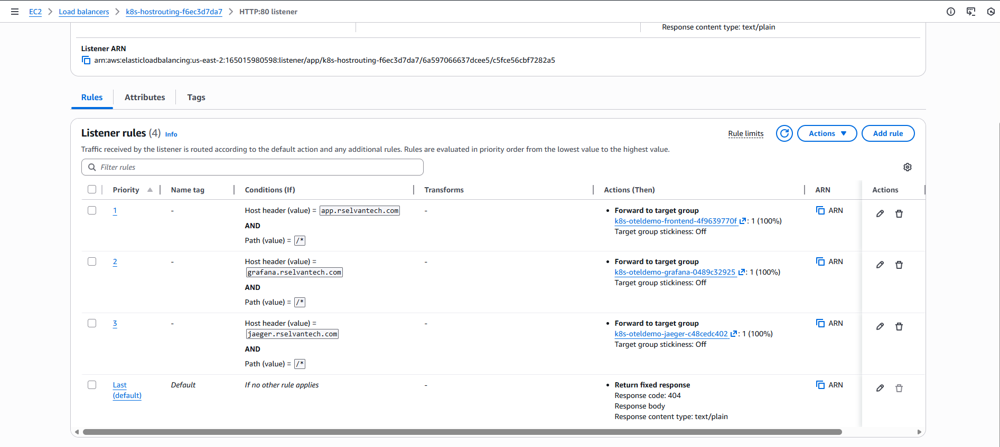
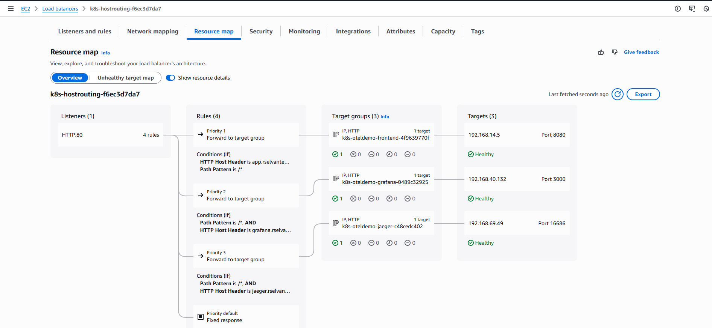
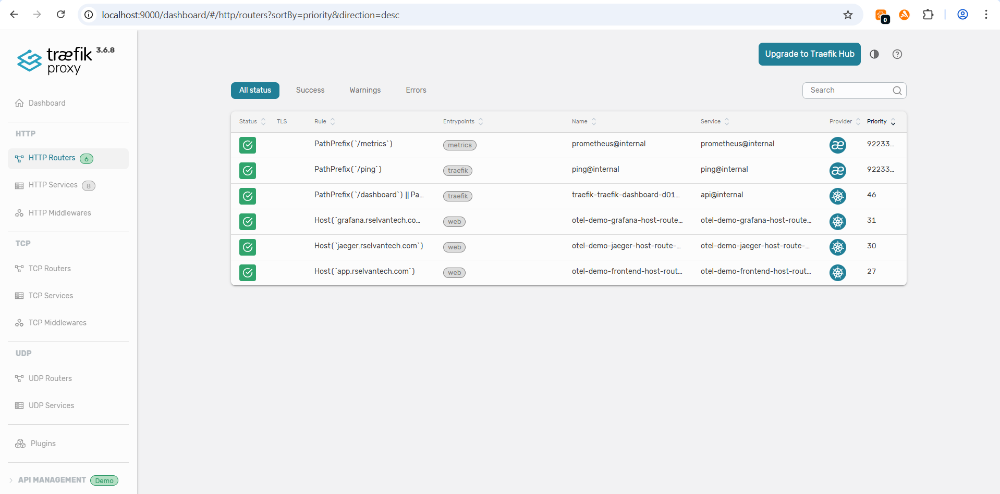

# Demo-05: Host-Based Routing

## Demo Overview

This demo implements **host-based routing** (also called virtual hosting or subdomain routing) using a real registered domain. Instead of differentiating services by URL path like `/grafana` or `/jaeger`, each service gets its own subdomain — making URLs cleaner and eliminating all path rewriting complexity.

**Run ALB and Traefik demos separately** — they cannot both own the same subdomains at the same time.

**What you'll do:**
- Reinstall OTel demo with a Grafana `domain` fix required for host-based routing
- Install external-dns to automate DNS record management in Route53
- Create host-based Ingress rules for ALB and Traefik
- Route `app.rselvantech.com` → frontend-proxy, `grafana.rselvantech.com` → Grafana, `jaeger.rselvantech.com` → Jaeger
- Understand what needs to be done manually if you skip external-dns
- Compare ALB vs Traefik host-based routing implementation

## Prerequisites

**From Previous Demos:**
- ✅ Completed `00-otel-demo-app` - EKS Cluster installed and OTel Demo running
- ✅ Completed `01-aws-alb-controller` - ALB Controller installed
- ✅ Completed `02-traefik-controller` - Traefik installed
- ✅ Completed `03-expose-frontend` - Basic Ingress understanding
- ✅ Completed `04-path-based-routing` - Path routing understanding

**New prerequisite for this demo:**
- ✅ Domain `rselvantech.com` registered in Route53
- ✅ Hosted zone auto-created by Route53 at registration
- ✅ Email verification done  (ICANN requirement, within 15 days)

**Verify Prerequisites:**

### 1. Check OTel services exist
```bash
kubectl get svc -n otel-demo frontend-proxy jaeger grafana
```

**Expected:**
```
NAME             TYPE        CLUSTER-IP      EXTERNAL-IP   PORT(S)     AGE
frontend-proxy   ClusterIP   10.100.142.85   <none>        8080/TCP    6m
jaeger           ClusterIP   10.100.98.154   <none>        16686/TCP   6m
grafana          ClusterIP   10.100.167.18   <none>        80/TCP      6m
```

### 2. Check endpoints
```bash
kubectl get endpoints frontend-proxy jaeger grafana -n otel-demo
```

**Expected: All 3 services have endpoints assigned**
```
NAME             ENDPOINTS                                                               AGE
frontend-proxy   192.168.37.147:8080                                                     7m46s
jaeger           192.168.90.66:4317,192.168.90.66:14268,192.168.90.66:4318 + 9 more...   7m46s
grafana          192.168.37.150:3000                                                     7m46s
```

### 3. Check controllers installed
```bash
kubectl get ingressclass
```

**Expected: alb and traefik**
```
NAME      CONTROLLER                      PARAMETERS   AGE
alb       ingress.k8s.aws/alb             <none>       10m
traefik   traefik.io/ingress-controller   <none>       6m39s
```

### 4. Check ALB Controller Deployment
```bash
kubectl get deployment aws-load-balancer-controller -n kube-system
```

**Expected: All ALB controller pods are READY**
```
NAME                           READY   UP-TO-DATE   AVAILABLE   AGE
aws-load-balancer-controller   2/2     2            2           16m
```

### 5. Check Traefik service
```bash
kubectl get svc traefik -n traefik
```

**Expected: NLB DNS assigned**
```
NAME      TYPE           CLUSTER-IP      EXTERNAL-IP                                                                   PORT(S)                      AGE
traefik   LoadBalancer   10.100.196.90   k8s-traefik-traefik-813afc9727-5cdd2e25a133d32c.elb.us-east-2.amazonaws.com   80:32195/TCP,443:30647/TCP   12m
```

### 6. Check hosted zone exists
```bash
aws route53 list-hosted-zones-by-name \
  --dns-name rselvantech.com \
  --query "HostedZones[0].{Name:Name,Id:Id,Records:ResourceRecordSetCount}" \
  --output table
```

**Expected:**
```
------------------------------------------------------------
|              ListHostedZonesByName                       |
+--------+-----------------------+-----------+------------+
|  Name  |  Id                   |  Records  |
+--------+-----------------------+-----------+
| rselvantech.com. | /hostedzone/ZXXXXXX | 2 |
+--------+-----------------------+-----------+
```
2 records = NS and SOA (auto-created at registration)

---

## Demo Objectives

By the end of this demo, you will:

1. ✅ Understand host-based routing and how it differs from path-based routing
2. ✅ Understand the Grafana `domain` config change required for host-based routing and why
3. ✅ Understand what external-dns does and why it is used
4. ✅ Understand the IAM policy and external-dns Helm values required
5. ✅ Implement host-based routing with ALB Controller
6. ✅ Implement host-based routing with Traefik
7. ✅ Know what to do manually if you choose not to use external-dns

---

## Concepts

### Host-Based Routing vs Path-Based Routing

| | Path-Based (Demo-04) | Host-Based (Demo-05) |
|---|---|---|
| URL | `alb-dns/grafana/` | `grafana.rselvantech.com/grafana/` |
| Routing key | URL path (`/grafana`) | `Host` header (`grafana.rselvantech.com`) |
| Requires real domain? | No | Yes |
| Path rewriting needed? | Jaeger needed StripPrefix | Never |
| Production use | Internal APIs | Multi-app / SaaS deployments |

**How routing decisions happen:**

Every HTTP/1.1 request carries a `Host` header that the browser sets automatically:

```
GET / HTTP/1.1
Host: grafana.rselvantech.com     ← ALB / Traefik reads this to decide routing
Accept: text/html
```

The load balancer (ALB) or proxy (Traefik) matches this header against its rules and forwards to the correct backend service — without touching the path at all.

---

### What is external-dns?

**external-dns** is a Kubernetes controller that watches Ingress and Service resources and automatically creates, updates, and deletes DNS records in your DNS provider (Route53 in our case).

**Without external-dns**, after you create an Ingress, AWS assigns an ALB with a hostname like:
```
k8s-oteldemo-abc123-1234567890.us-east-1.elb.amazonaws.com
```
You then have to **manually** go into Route53 and create CNAME or ALIAS records pointing `grafana.rselvantech.com` to that hostname — and repeat every time you create, update, or delete an Ingress.

**With external-dns**, this happens automatically:

```
kubectl apply -f src/albc-ingress-host-based.yaml
        ↓
external-dns sees new Ingress with hostname annotation
        ↓
external-dns calls Route53 API
        ↓
ALIAS record created: grafana.rselvantech.com → ALB DNS
        ↓
DNS propagates in ~1 minute
```

**What external-dns manages:**
- Creates DNS records when Ingress is created
- Updates DNS records when ALB hostname changes
- Deletes DNS records when Ingress is deleted (with `policy: sync`)
- Creates TXT ownership records alongside each DNS record to track what it owns

---

### The IAM Policy Explained

external-dns runs as a pod inside EKS. It needs an IAM role (granted via IRSA) to call the Route53 API:

```json
{
  "Statement": [
    {
      "Effect": "Allow",
      "Action": [
        "route53:ChangeResourceRecordSets",   ← create / update / delete records
        "route53:ListResourceRecordSets",     ← read records (detect drift)
        "route53:ListTagsForResources"        ← read tags (ownership tracking)
      ],
      "Resource": ["arn:aws:route53:::hostedzone/*"]  ← hosted zones only, not registrar
    },
    {
      "Effect": "Allow",
      "Action": ["route53:ListHostedZones"],  ← discover zone IDs
      "Resource": ["*"]                       ← must be * (no resource-level scope for this action)
    }
  ]
}
```

**How the permission flows (IRSA):**

```
external-dns Pod
    │  uses Kubernetes ServiceAccount
    ▼
ServiceAccount
    │  annotated: eks.amazonaws.com/role-arn: arn:aws:iam::ACCT:role/external-dns-role
    ▼
IAM Role (trust policy allows EKS OIDC → ServiceAccount)
    │  has AllowExternalDNSUpdates policy attached
    ▼
Route53 API  ← external-dns can now read/write DNS records
```

No static credentials or access keys — the pod gets short-lived AWS credentials automatically via OIDC token projection.

---

### external-dns Helm Values Explained

```yaml
provider:
  name: aws
```
Tells external-dns which DNS provider to use. `provider.name` (not the legacy `provider: aws`) is the correct field since chart v1.13+.

```yaml
sources:
  - service
  - ingress
```
What Kubernetes resources external-dns watches for DNS annotations. `service` is needed for Traefik (annotation on the NLB Service). `ingress` is needed for ALB (annotation on the Ingress object).

```yaml
domainFilters:
  - rselvantech.com
```
Restricts external-dns to only manage records under `rselvantech.com`. Prevents accidental changes to any other hosted zone in the account.

```yaml
policy: sync
```
Controls record lifecycle. `sync` = create, update, AND delete records when the Ingress/Service is removed. `upsert-only` = never delete (safer but leaves stale records after cleanup). Use `sync` so Route53 is cleaned up automatically.

```yaml
registry: txt
txtOwnerId: external-dns-rselvantech
```
external-dns creates a TXT record alongside each A/ALIAS record as an ownership marker (e.g. `"heritage=external-dns,owner=external-dns-rselvantech"`). This prevents conflicts if multiple external-dns instances run, and allows `policy: sync` to safely delete only records it owns.

```yaml
extraArgs:
  aws-zone-type: public
```
Only manage public hosted zones. Prevents external-dns from touching private/internal Route53 zones if any exist.

```yaml
serviceAccount:
  create: false
  name: external-dns
```
eksctl already created the ServiceAccount with the IAM role annotation when you ran `eksctl create iamserviceaccount`. Setting `create: false` tells Helm to use that existing ServiceAccount instead of creating a new one without the annotation.

```yaml
policy: sync
interval: 1m
deploymentStrategy:
  type: Recreate
```
`interval: 1m` — how often to reconcile DNS with cluster state. `Recreate` strategy — only one external-dns pod should run at a time to avoid duplicate Route53 API calls.

---

### How external-dns Discovers the Load Balancer Hostname

external-dns needs two pieces of information to create a DNS record:
1. **The subdomain names** to create — from `external-dns.alpha.kubernetes.io/hostname` annotation
2. **The load balancer hostname** to point those records at — from `.status.loadBalancer.ingress[0].hostname`

Where it reads these depends on which ingress controller you are using.

**ALB Controller**

ALBC creates a **new load balancer per Ingress resource**. The ALB hostname appears in the Ingress object's `.status` field. So external-dns watches the **Ingress object** for both the annotation and the ALB hostname:

```
Ingress object
  ├── metadata.annotations
  │     └── external-dns.alpha.kubernetes.io/hostname: app.rselvantech.com,...  ← subdomain names
  └── status.loadBalancer.ingress[0].hostname
        └── k8s-oteldemo-abc123.us-east-1.elb.amazonaws.com                    ← ALB DNS
```

**Traefik**

Traefik's NLB is created **once at install time** as a Kubernetes Service (LoadBalancer type). The NLB hostname appears in the Traefik Service's `.status` field — not in IngressRoute objects, which have no `.status.loadBalancer` field at all. So external-dns watches the **Traefik Service** for both the annotation and the NLB hostname:

```
Traefik Service (traefik namespace)
  ├── metadata.annotations
  │     └── external-dns.alpha.kubernetes.io/hostname: app.rselvantech.com,...  ← subdomain names
  └── status.loadBalancer.ingress[0].hostname
        └── k8s-traefik-abc123.us-east-2.elb.amazonaws.com                     ← NLB DNS
```

**Summary**

| Controller | Annotation goes on | Load balancer hostname read from |
|---|---|---|
| ALB | Ingress object | Ingress `.status.loadBalancer` |
| Traefik | Traefik Service | Service `.status.loadBalancer` |

This is why the ALB demo puts the annotation inside `albc-ingress-host-based.yaml`, while the Traefik demo runs `kubectl annotate service traefik` — they are the same mechanism, just applied to different Kubernetes objects depending on where the load balancer hostname lives.

---

### Architecture & Message Flow

```
                    ┌──────────────────────────────────────────┐
                    │        Route53 Hosted Zone               │
                    │        rselvantech.com                   │
                    │                                          │
                    │  app.rselvantech.com     ALIAS → ALB     │
                    │  grafana.rselvantech.com ALIAS → ALB     │
                    │  jaeger.rselvantech.com  ALIAS → ALB     │
                    │  (+ TXT ownership records)               │
                    │  ← auto-managed by external-dns          │
                    └──────────────┬───────────────────────────┘
                                   │ DNS resolution
                                   ▼
Browser sends:
GET / HTTP/1.1
Host: grafana.rselvantech.com
                    ┌──────────────────────────────────────────┐
                    │      AWS Application Load Balancer       │
                    │                                          │
                    │  Rule 1: Host=app.rselvantech.com        │
                    │          → frontend-proxy:8080           │
                    │  Rule 2: Host=grafana.rselvantech.com    │
                    │          → grafana:80          ◄─────────┘
                    │  Rule 3: Host=jaeger.rselvantech.com     │
                    │          → jaeger:16686                  │
                    │  Default: 404                            │
                    └──────────────────────────────────────────┘
                                   │
                    ┌──────────────▼───────────────────────────┐
                    │      EKS  otel-demo  namespace           │
                    │  frontend-proxy:8080                     │
                    │  grafana:80                              │
                    │  jaeger:16686                            │
                    └──────────────────────────────────────────┘

                    ┌──────────────────────────────────────────┐
                    │  external-dns (watches Ingress/Service)  │
                    │  Ingress created → Route53 API           │
                    │  → creates ALIAS + TXT records           │
                    │  Ingress deleted → Route53 API           │
                    │  → deletes records (policy: sync)        │
                    └──────────────────────────────────────────┘
```

---


## Directory Structure

```
05-host-based-routing/
├── README.md
└── src/
    ├── otel-demo-app-values.yaml            # OTel demo values (Grafana domain fix added)
    ├── external-dns-iam-policy.json         # IAM policy for Route53 access
    ├── external-dns-values.yaml             # Helm values for external-dns
    ├── albc-ingress-host-based.yaml         # ALB host-based Ingress
    ├── traefik-ingressroute-host-based.yaml # Traefik IngressRoute CRD
    └── traefik-ingress-host-based.yaml      # Traefik standard Ingress (alternative)
```

---

## Part 0: Reinstall OTel Demo App with Grafana Fix

### Step 0: Understanding the Grafana domain Change

**What changed and why:**

In `grafana.ini`, the OTel demo ships with:

```ini
[server]
domain = ''
root_url = %(protocol)s://%(domain)s:%(http_port)s/grafana
serve_from_sub_path = true
```

`%(domain)s` is a Grafana template variable that resolves from the `domain` field — **not** from the incoming HTTP `Host` header. When `domain = ''` (empty), Grafana falls back to `localhost:3000` when building redirect `Location` headers.

**Why this did NOT affect Demo-04 (path-based routing):**

In Demo-04, users accessed Grafana at `alb-dns/grafana/` — the path `/grafana/` was already present in the URL. Grafana received requests directly at `/grafana/` and served them without needing to redirect. The broken `localhost:3000` redirect was never triggered.

**Why this DOES affect Demo-05 (host-based routing):**

In Demo-05, users access `grafana.rselvantech.com/` — the browser sends `/` as the path. Grafana receives a request at `/` which it does not serve directly. It issues a server-side HTTP 301 redirect to `/grafana/`, building the Location header using its configured `root_url`:

```
%(protocol)s://%(domain)s:%(http_port)s/grafana
= http://localhost:3000/grafana    ← localhost because domain = ''
```

The browser follows this redirect to `localhost:3000` — which is unreachable externally:
```
GET http://grafana.rselvantech.com/
← 301 Location: http://localhost:3000/grafana/   ← broken
Browser tries localhost:3000 → ERR_CONNECTION_REFUSED
```

**The fix:**

Set `root_url` explicitly in `grafana.ini` to bypass the template variables entirely:

```yaml
# src/otel-demo-app-values.yaml
grafana:
  grafana.ini:
    server:
      domain: grafana.rselvantech.com
      root_url: "http://grafana.rselvantech.com/grafana"
      serve_from_sub_path: true
```

After the fix:
```
GET http://grafana.rselvantech.com/
← 301 Location: http://grafana.rselvantech.com/grafana/  ✅
GET http://grafana.rselvantech.com/grafana/  ✅
```

**Why not fix at the Traefik/ALB layer instead?**
A redirect middleware at the proxy layer would intercept `/` before it reaches Grafana — but Grafana's internal links and API calls also use `root_url`. Fixing only the entry redirect would break Grafana's internal navigation. Setting `root_url` correctly fixes all redirects that Grafana generates, not just the initial one.

---

### Step 1: Uninstall and Reinstall OTel Demo

> As per OTel demo documentation, `helm upgrade` is not recommended. Always uninstall and reinstall.

```bash
helm uninstall otel-demo -n otel-demo
```

Wait for all pods to terminate:

```bash
kubectl get pods -n otel-demo
```
**Expected output**
```
No resources found in otel-demo namespace.
```

Reinstall with updated values file:

```bash
cd 05-host-based-routing/src

helm install otel-demo open-telemetry/opentelemetry-demo \
  --namespace otel-demo \
  --create-namespace \
  --values otel-demo-app-values.yaml
```

Wait for all pods to be ready:

```bash
kubectl get pods -n otel-demo -w
```

**Expected: All pods Running**

---

### Step 2: Verify Grafana Fix

```bash
# Confirm domain is set correctly in grafana.ini
kubectl exec -n otel-demo deployment/grafana -- \
  cat /etc/grafana/grafana.ini | grep -A5 "\[server\]"
```

**Expected:**
```ini
[server]
domain = grafana.rselvantech.com
root_url = http://grafana.rselvantech.com/grafana
serve_from_sub_path = true
```

---

## Part A: Install external-dns

### Step 3: Get Hosted Zone ID

```bash
export ZONE_ID=$(aws route53 list-hosted-zones-by-name \
  --dns-name rselvantech.com \
  --query "HostedZones[0].Id" \
  --output text | cut -d'/' -f3)
echo "Zone ID: $ZONE_ID"
```

**Expected:**
```
Zone ID: Z1234567890ABCDEF
```

---

### Step 4: Create IAM Policy

```bash

aws iam create-policy \
  --policy-name AllowExternalDNSUpdates \
  --policy-document file://external-dns-iam-policy.json

export POLICY_ARN=$(aws iam list-policies \
  --query 'Policies[?PolicyName==`AllowExternalDNSUpdates`].Arn' \
  --output text)
echo "Policy ARN: $POLICY_ARN"
```

---

### Step 5: Create IRSA (IAM Role for Service Account)

```bash
eksctl get cluster
export CLUSTER_NAME=<your-cluster-name>
# export AWS_REGION=<your-region> 

# Associate OIDC provider (skip if already done in a previous demo)
# eksctl utils associate-iam-oidc-provider \
#   --cluster $CLUSTER_NAME \
#   --approve

# Create namespace
kubectl create namespace external-dns

# Create IAM ServiceAccount
# eksctl creates: IAM role + trust policy + Kubernetes ServiceAccount
# with the IAM role ARN annotation applied automatically
eksctl create iamserviceaccount \
  --cluster $CLUSTER_NAME \
  --namespace external-dns \
  --name external-dns \
  --attach-policy-arn $POLICY_ARN \
  --approve \
  --override-existing-serviceaccounts
```

**Verify the IAM role annotation was applied:**

```bash
kubectl get serviceaccount external-dns -n external-dns -o yaml | grep role-arn
```

**Expected:**
```
eks.amazonaws.com/role-arn: arn:aws:iam::123456789012:role/eksctl-...
```

---

### Step 6: Install external-dns via Helm

```bash
helm repo add external-dns https://kubernetes-sigs.github.io/external-dns/
helm repo update

helm upgrade --install external-dns external-dns/external-dns \
  --version 1.20.0 \
  --namespace external-dns \
  --values external-dns-values.yaml
```

**Verify pod is running:**

```bash
kubectl get pods -n external-dns
```

**Expected:**
```
NAME                            READY   STATUS    RESTARTS   AGE
external-dns-5d89c8f8b7-xzp2k   1/1     Running   0          45s
```

**Verify logs show Route53 connectivity:**

```bash
kubectl logs -n external-dns -l app.kubernetes.io/name=external-dns --tail=10
```

**Expected:**
```
time="..." level=info msg="Connected to cluster"
time="..." level=info msg="All records are already up to date"
```

---

## Part B: Host-Based Routing with ALB Controller

### Step 7: Understanding the ALB Ingress Configuration

Review `src/albc-ingress-host-based.yaml` key sections:

**`kubernetes.io/ingress.class: alb`**
Selects the AWS Load Balancer Controller to process this Ingress. Without this, no ALB is created.
This is Deprecated. use `spec.ingressClassName`

**`alb.ingress.kubernetes.io/scheme: internet-facing`**
Creates a public ALB reachable from the internet. Use `internal` for VPC-only access.

**`alb.ingress.kubernetes.io/target-type: ip`**
Routes directly to pod IPs (requires AWS VPC CNI). Alternative is `instance` which routes via NodePort — works without VPC CNI but adds an extra hop.

**`alb.ingress.kubernetes.io/group.name: host-routing`**
Groups this Ingress with others sharing the same group name onto a single ALB. All Ingresses with `group.name: host-routing` share one ALB — consistent with Demo-04's cost optimization approach.

**`alb.ingress.kubernetes.io/healthcheck-path: /`**
All 3 services respond healthy on `/`. This is simpler than Demo-04 where Grafana needed `/grafana/` as its health check path because the ALB was sending traffic to `/grafana` directly. In host-based routing, health checks still go to `/` — and Grafana returns a 301 redirect to `/grafana/`, which falls within `success-codes: "200-399"`.

**`external-dns.alpha.kubernetes.io/hostname`** 
List here the subdomain names to create records for (app.rselvantech.com, grafana.rselvantech.com, jaeger.rselvantech.com).
This annotation is what triggers external-dns to create Route53 records. external-dns also reads the ALB hostname from `.status.loadBalancer.ingress[0].hostname` and creates ALIAS records for each listed subdomain pointing to that ALB hostname.
external-dns reads subdomains only from this annotation. The annotation is mandatory — without it, external-dns creates no records regardless of what is in `spec.rules[].host`

**`spec.rules[].host`**
The host field in each rule is what the ALB uses to create listener rules. ALB reads the `Host` HTTP header from incoming requests and matches it against these values. Each host gets an independent rule — completely separate from the other hosts.

**No `pathType: Prefix` complexity**
Compare to Demo-04 where Jaeger needed a `RewriteConfig` action annotation. Here every rule uses `path: /` with `pathType: Prefix` — the full request path is forwarded as-is to the backend service which serves it natively.

---

### Step 8: Apply ALB Host-Based Ingress

```bash
kubectl apply -f albc-ingress-host-based.yaml
```

**Wait for ALB to provision (~2-3 minutes):**

```bash
kubectl get ingress host-based-alb -n otel-demo -w
```

**Expected:**
```
NAME              CLASS   HOSTS                            ADDRESS                                           PORTS   AGE
host-based-alb    alb     app.rselvantech.com,...          k8s-oteldemo-abc123.us-east-1.elb.amazonaws.com   80      3m
```

---

### Step 9: Verify external-dns Created Route53 Records

```bash
kubectl logs -n external-dns -l app.kubernetes.io/name=external-dns -f
```

**Expected log output:**
```
time="..." level=info msg="Desired change: CREATE app.rselvantech.com A"
time="..." level=info msg="Desired change: CREATE app.rselvantech.com TXT"
time="..." level=info msg="Desired change: CREATE grafana.rselvantech.com A"
time="..." level=info msg="Desired change: CREATE grafana.rselvantech.com TXT"
time="..." level=info msg="Desired change: CREATE jaeger.rselvantech.com A"
time="..." level=info msg="Desired change: CREATE jaeger.rselvantech.com TXT"
time="..." level=info msg="6 record(s) in zone rselvantech.com. were successfully updated"
```

**Verify in Route53:**

```bash
aws route53 list-resource-record-sets \
  --hosted-zone-id $ZONE_ID \
  --query "ResourceRecordSets[?Type!='NS' && Type!='SOA'].[Name,Type]" \
  --output table
```

**Expected:**
```
--------------------------------------------
|          ListResourceRecordSets          |
+----------------------------------+-------+
|  aaaa-app.rselvantech.com.       |  TXT  |
|  aaaa-grafana.rselvantech.com.   |  TXT  |
|  aaaa-jaeger.rselvantech.com.    |  TXT  |
|  app.rselvantech.com.            |  A    |
|  app.rselvantech.com.            |  AAAA |
|  cname-app.rselvantech.com.      |  TXT  |
|  cname-grafana.rselvantech.com.  |  TXT  |
|  cname-jaeger.rselvantech.com.   |  TXT  |
|  grafana.rselvantech.com.        |  A    |
|  grafana.rselvantech.com.        |  AAAA |
|  jaeger.rselvantech.com.         |  A    |
|  jaeger.rselvantech.com.         |  AAAA |
+----------------------------------+-------+
```

---

### Step 10: Verify ALB Listener Rules

```bash
ALB_DNS=$(kubectl get ingress host-based-alb -n otel-demo \
  -o jsonpath='{.status.loadBalancer.ingress[0].hostname}')

ALB_ARN=$(aws elbv2 describe-load-balancers \
  --query "LoadBalancers[?contains(DNSName, '$(echo $ALB_DNS | cut -d'.' -f1)')].LoadBalancerArn" \
  --output text)

LISTENER_ARN=$(aws elbv2 describe-listeners \
  --load-balancer-arn $ALB_ARN \
  --query 'Listeners[?Port==`80`].ListenerArn' \
  --output text)

aws elbv2 describe-rules --listener-arn $LISTENER_ARN \
  --query 'Rules[].{Priority:Priority,Host:Conditions[?Field==`host-header`].Values}' \
  --output table
```
**Expected:**
```
---------------------------------------------------
|              DescribeRules                      |
+----------+--------------------------------------+
| Priority | Host                                 |
+----------+--------------------------------------+
|  1       |  app.rselvantech.com                 |
|  2       |  grafana.rselvantech.com             |
|  3       |  jaeger.rselvantech.com              |
|  default |  (returns 404)                       |
+----------+--------------------------------------+
```

**Listener**


**Rules**


**Resource map**



**Key observation:** 
- Rules use `host-header` conditions (not `path-pattern` like Demo-04).
- All traget groups and targets are healthy

---

### Step 11: Test ALB Host-Based Routing

**Verify DNS resolves:**

```bash
dig +short app.rselvantech.com
dig +short grafana.rselvantech.com
dig +short jaeger.rselvantech.com
```

**Note:** 
- Each returns IP addresses (ALB IPs).
- If any does not retunr IP, Check **Troubleshooting** section for more info on troubleshooting this


**Test frontend:**

```bash
curl -I http://app.rselvantech.com/
```

**Expected:**
```
HTTP/1.1 200 OK
```

**Test Grafana redirect (now uses correct domain):**

```bash
curl -v http://grafana.rselvantech.com/ 2>&1 | grep -i "location"
```

**Expected:**
```
< Location: http://grafana.rselvantech.com/grafana/   ✅  (not localhost:3000)
```

**Test Jaeger:**

```bash
curl -I http://jaeger.rselvantech.com/
```

**Expected:**
```
HTTP/1.1 200 OK
```

**Verify In browser:**
```
http://app.rselvantech.com              → OTel Demo Store
http://grafana.rselvantech.com          → Grafana dashboards (redirects to /grafana/)
http://jaeger.rselvantech.com           → Jaeger UI (JS redirects to /jaeger/ui/search)
```

---

## Part C: Important Run ALBC and Traefik Demos Separately

 Both ALBC and Traefik route the same three subdomains (`app.rselvantech.com`, `grafana.rselvantech.com`, `jaeger.rselvantech.com`). They cannot run simultaneously — external-dns can only point each subdomain to one load balancer at a time.

**What happens if you run Part D(Traefik) without cleaning up Part B(ALBC):**

external-dns sees the Traefik Service annotation requesting the same subdomains that the ALB Ingress already owns. Since the Route53 records already exist (pointing to the ALB), external-dns reports `All records are already up to date` and makes no changes. DNS continues pointing to the ALB — Traefik never receives any traffic.

**Before starting Part D, clean up Part B:**

```bash
# Step 1 — Delete ALB Ingress
kubectl delete -f albc-ingress-host-based.yaml

# Step 2 — Wait for external-dns to delete the ALB records (~1 min)
kubectl logs -n external-dns -l app.kubernetes.io/name=external-dns -f
# Wait until you see:
# "Desired change: DELETE app.rselvantech.com A"
# "Desired change: DELETE grafana.rselvantech.com A"
# "Desired change: DELETE jaeger.rselvantech.com A"

# Step 3 — Verify Route53 records are gone
aws route53 list-resource-record-sets \
  --hosted-zone-id $ZONE_ID \
  --query "ResourceRecordSets[?Type!='NS' && Type!='SOA'].[Name,Type]" \
  --output table
```

Once Route53 is clean, external-dns will pick up the Traefik Service annotation and create new records pointing to the NLB within one sync interval (~1 minute).

**To switch back from Traefik to ALB:**

```bash
# Remove Traefik annotation
kubectl annotate service traefik -n traefik \
  external-dns.alpha.kubernetes.io/hostname-

# Wait for records to be deleted, then reapply ALB Ingress
kubectl apply -f src/albc-ingress-host-based.yaml
```


## Part D: Host-Based Routing with Traefik

### Step 12: Understanding the Traefik IngressRoute Configuration

Review `src/traefik-ingressroute-host-based.yaml` key sections:

**`apiVersion: traefik.io/v1alpha1`**
Traefik's native CRD API version for v3.x. More expressive than standard Kubernetes Ingress.

**`entryPoints: [web]`**
Specifies which Traefik entryPoint (listener) this route applies to. `web` = HTTP port 80 defined in the Traefik Helm installation. `websecure` = HTTPS port 443 (used in Demo-06 TLS).

**`match: Host(\`grafana.rselvantech.com\`)`**
Traefik's rule expression language. Evaluates the incoming `Host` header. Compare to Demo-04 which used `PathPrefix(\`/grafana\`)`. The syntax is identical — only the matcher function changes.

**No Middleware needed**
In Demo-04, Jaeger required a `StripPrefix` middleware because the request arrived at `/jaeger` but Jaeger expected `/`. Here Jaeger receives requests at `/` via its own subdomain — no transformation needed. Grafana similarly receives requests at `/grafana/` via its subdomain — no transformation needed.

**DNS for Traefik via Service annotation (not IngressRoute)**
external-dns watches the Traefik LoadBalancer **Service** for the `external-dns.alpha.kubernetes.io/hostname` annotation — not the IngressRoute. The NLB hostname is on the Service, so that is where the annotation lives.

---

### Step 13: Annotate Traefik Service for external-dns

```bash
kubectl annotate service traefik -n traefik \
  "external-dns.alpha.kubernetes.io/hostname=app.rselvantech.com,grafana.rselvantech.com,jaeger.rselvantech.com"
```

**Verify:**

```bash
kubectl get svc traefik -n traefik \
  -o jsonpath='{.metadata.annotations.external-dns\.alpha\.kubernetes\.io/hostname}'
```

**Watch external-dns update records to NLB hostname:**

```bash
kubectl logs -n external-dns -l app.kubernetes.io/name=external-dns -f
```

---

### Step 14: Apply Traefik IngressRoute

```bash
kubectl apply -f traefik-ingressroute-host-based.yaml
```

**Verify routes created:**

```bash
kubectl get ingressroute -n otel-demo
```

**Expected:**
```
NAME                   AGE
frontend-host-route    10s
grafana-host-route     10s
jaeger-host-route      10s
```

**Check Traefik dashboard (optional):**

```bash
kubectl port-forward -n traefik deployment/traefik 9000:9000
```

Open: http://localhost:9000/dashboard/
Navigate to HTTP → Routers → verify 3 host-based routers appear with `Host()` rules.



---

### Step 15: Test Traefik Host-Based Routing

**Test with explicit Host header (bypasses DNS — useful before DNS propagates):**

```bash
TRAEFIK_DNS=$(kubectl get svc traefik -n traefik \
  -o jsonpath='{.status.loadBalancer.ingress[0].hostname}')

curl -I -H "Host: app.rselvantech.com" http://$TRAEFIK_DNS/
curl -I -H "Host: grafana.rselvantech.com" http://$TRAEFIK_DNS/
curl -I -H "Host: jaeger.rselvantech.com" http://$TRAEFIK_DNS/
```

**Expected:** All return `HTTP/1.1 200 OK` or `HTTP/1.1 301` (Grafana redirect to `/grafana/`)

**Verify DNS resolves:**

```bash
dig +short app.rselvantech.com
dig +short grafana.rselvantech.com
dig +short jaeger.rselvantech.com
```

**Note:** 
- Each returns IP addresses (ALB IPs).
- If any does not retunr IP, Check **Troubleshooting** section for more info on troubleshooting this

```bash
curl -v http://grafana.rselvantech.com/ 2>&1 | grep -i "location"
```

**Expected:**
```
< Location: http://grafana.rselvantech.com/grafana/  ✅
```

**Verify In browser:**
```
http://app.rselvantech.com              → OTel Demo Store
http://grafana.rselvantech.com          → Grafana dashboards (redirects to /grafana/)
http://jaeger.rselvantech.com           → Jaeger UI (JS redirects to /jaeger/ui/search)
```
---

## Part E: Comparison

### Step 16: ALB vs Traefik Host-Based Routing

| Aspect | ALB Controller | Traefik |
|--------|----------------|---------|
| **Routing config** | `spec.rules[].host` in Ingress | `Host()` rule in IngressRoute |
| **DNS annotation location** | On the Ingress object | On the Traefik Service |
| **Middleware needed** | None | None |
| **No Traefik install change** | N/A | ✅ Just apply new IngressRoute |
| **Cost** | 1 ALB (~$17/month) | 1 NLB (~$17/month) |
| **Debugging** | ALB console → Listener rules (host-header) | Traefik dashboard → Routers |

### Step 17: Host-Based vs Path-Based — When to Use Which

| Scenario | Recommendation |
|----------|----------------|
| Multiple unrelated apps | Host-based — clean separation |
| API versioning (`/v1`, `/v2`) | Path-based — same domain |
| No domain available / local testing | Path-based — works with raw IP |
| SaaS (`customer1.app.com`) | Host-based — per-tenant isolation |
| Services that need path rewriting | Host-based — eliminates the problem |

---

## Part F: Manual DNS Configuration (without external-dns)

If you choose **not to install external-dns**, manage Route53 records manually every time an Ingress is created, updated, or deleted.

**For ALB:**

```bash
# Step 1 — Get ALB hostname after applying Ingress
ALB_DNS=$(kubectl get ingress host-based-alb -n otel-demo \
  -o jsonpath='{.status.loadBalancer.ingress[0].hostname}')

# Step 2 — Get hosted zone ID
ZONE_ID=$(aws route53 list-hosted-zones-by-name \
  --dns-name rselvantech.com \
  --query "HostedZones[0].Id" --output text | cut -d'/' -f3)

# Step 3 — Create ALIAS records for each subdomain
for SUBDOMAIN in app grafana jaeger; do
  aws route53 change-resource-record-sets \
    --hosted-zone-id $ZONE_ID \
    --change-batch '{
      "Changes": [{
        "Action": "UPSERT",
        "ResourceRecordSet": {
          "Name": "'$SUBDOMAIN'.rselvantech.com",
          "Type": "A",
          "AliasTarget": {
            "HostedZoneId": "Z35SXDOTRQ7X7K",
            "DNSName": "'$ALB_DNS'",
            "EvaluateTargetHealth": true
          }
        }
      }]
    }'
done
```

> `Z35SXDOTRQ7X7K` is the canonical hosted zone ID for ALB in us-east-1. Varies by region — see [AWS ELB endpoints documentation](https://docs.aws.amazon.com/general/latest/gr/elb.html).

**For Traefik:** Same steps but use the NLB hostname from `kubectl get svc traefik -n traefik` and canonical zone ID `Z26RNL4JYFTOTI` for NLB in us-east-1.

**On cleanup — delete records manually:**
```bash
# Replace Action: UPSERT with Action: DELETE and repeat the same command
```

| Task | Manual | With external-dns |
|------|--------|-------------------|
| Create DNS on new Ingress | Manual CLI each time | Automatic (~1 min) |
| Update DNS when ALB changes | Manual | Automatic |
| Delete DNS on Ingress removal | Manual (easy to forget → stale records) | Automatic with `policy: sync` |

---

## Validation Checklist

Before proceeding, verify:

- [ ] OTel demo reinstalled with updated values file
- [ ] `grafana.ini` shows `root_url = http://grafana.rselvantech.com/grafana`
- [ ] external-dns pod running in `external-dns` namespace
- [ ] Route53 ALIAS + TXT records created for all 3 subdomains
- [ ] ALB listener shows `host-header` rules (not `path-pattern`)
- [ ] `curl http://grafana.rselvantech.com/` returns `Location: http://grafana.rselvantech.com/grafana/`
- [ ] All 3 subdomains accessible in browser
- [ ] Traefik IngressRoute routes by `Host()` rule
- [ ] Both ALB and Traefik host routing verified

---

## Cleanup

```bash
# Remove Ingress — external-dns auto-deletes Route53 records
kubectl delete -f src/albc-ingress-host-based.yaml
kubectl delete -f src/traefik-ingressroute-host-based.yaml

# Remove Traefik service annotation
kubectl annotate service traefik -n traefik \
  external-dns.alpha.kubernetes.io/hostname-

# Wait ~1 min, verify Route53 records are gone
aws route53 list-resource-record-sets \
  --hosted-zone-id $ZONE_ID \
  --query "ResourceRecordSets[?Type!='NS' && Type!='SOA'].Name" \
  --output text

# Uninstall external-dns
helm uninstall external-dns -n external-dns
kubectl delete namespace external-dns

# Delete IRSA
eksctl delete iamserviceaccount \
  --cluster $CLUSTER_NAME \
  --namespace external-dns \
  --name external-dns

# Delete IAM policy (keep if reusing in Demo-06)
aws iam delete-policy --policy-arn $POLICY_ARN
```

**Verify cleanup:**

```bash
kubectl get pods -n external-dns       # namespace should be gone
kubectl get ingress -n otel-demo       # host-based-alb removed
kubectl get ingressroute -n otel-demo  # host routes removed
```

---

## What You Learned

In this demo, you:
- ✅ Understood why Grafana needed a `domain` config change for host-based routing — and why path-based routing never exposed this issue
- ✅ Installed external-dns with IRSA and understood every parameter in its Helm values
- ✅ Understood the IAM policy required for Route53 access and how IRSA grants it securely
- ✅ Implemented host-based routing with ALB — no path rewriting, single health check path for all services
- ✅ Implemented host-based routing with Traefik — IngressRoute with `Host()` rule, no Middleware needed
- ✅ Understood what to do manually when external-dns is not used
- ✅ Understood when host-based routing is better than path-based routing

**Key Insight:**
Host-based routing eliminates all the path rewriting complexity from Demo-04. When each service has its own subdomain, it serves on its native path — no `StripPrefix`, no `RewriteConfig`, no health check path differences. The trade-off is that you need a real domain and DNS management (which external-dns automates).

---

## Lessons Learned

### 1. Grafana `domain` Must Be Set for Host-Based Routing

**Problem:** After applying host-based Ingress, `http://grafana.rselvantech.com/` redirected to `http://localhost:3000/grafana/` — unreachable externally.

**Root cause:** Grafana's `grafana.ini` uses template variables in `root_url`:
```ini
root_url = %(protocol)s://%(domain)s:%(http_port)s/grafana
```
`%(domain)s` resolves from the `domain` field, not from the incoming HTTP `Host` header. When `domain = ''`, Grafana falls back to `localhost:3000`.

**Why Demo-04 path-based routing was not affected:** In path-based routing, users accessed `/grafana/` directly in the URL. Grafana served it without triggering a redirect. The broken `localhost:3000` redirect only fires when Grafana receives a request at `/` (root) — which only happens in host-based routing where the entry point is `grafana.rselvantech.com/`.

**Fix:** Set `root_url` explicitly in the OTel demo values file:
```yaml
grafana:
  grafana.ini:
    server:
      domain: grafana.rselvantech.com
      root_url: "http://grafana.rselvantech.com/grafana"
      serve_from_sub_path: true
```

**Rule:** When moving from path-based to host-based routing, always verify that your services build redirect `Location` headers using the public domain — not a hardcoded internal hostname.


---

### 2. Jaeger Works Without Any Config Change

**Observation:** `http://jaeger.rselvantech.com/` worked immediately — browser automatically navigated to `/jaeger/ui/search`.

**Why:** Jaeger serves a static HTML page on `/` containing JavaScript. The JS performs a **client-side redirect** using the `base_path` config (`/jaeger/ui`). Because the redirect happens in the browser (not as a server-side HTTP Location header), it uses the current URL's domain (`jaeger.rselvantech.com`) — not any hardcoded hostname.

**Contrast with Grafana:** Grafana issues a **server-side HTTP 301** with a `Location` header built from its configured `root_url`. This is why Grafana was affected and Jaeger was not.

**Rule:** Server-side redirects (HTTP 3xx with Location header) depend on application config for hostname. Client-side redirects (JavaScript `window.location`) use the browser's current URL and are unaffected.

---

### 3. external-dns Annotation Location Differs Between ALB and Traefik

**ALB:** `external-dns.alpha.kubernetes.io/hostname` annotation goes on the **Ingress** object. external-dns reads `.status.loadBalancer.ingress[0].hostname` from the Ingress to get the ALB DNS name.

**Traefik:** The annotation goes on the **Traefik Service** (LoadBalancer type). The IngressRoute CRD has no `.status.loadBalancer` field — external-dns cannot read the NLB hostname from it.

**Rule:** Always put the external-dns hostname annotation where the load balancer hostname appears in `.status.loadBalancer.ingress[0].hostname`.

---

### 4. `policy: sync` Is Essential for Clean Teardown

With `policy: upsert-only` (the safer default), external-dns never deletes Route53 records. When you `kubectl delete` an Ingress, the DNS records remain — pointing to a deleted ALB, causing DNS errors for anyone who visits the domain.

With `policy: sync`, deleting the Ingress triggers external-dns to delete the corresponding Route53 records automatically within one sync interval (~1 minute).

**Rule:** Use `policy: sync` in demo and development environments for clean teardown. Consider `upsert-only` in production where accidental deletion is a greater risk than stale records.

---

## Next Steps

**Demo-06: TLS / HTTPS**
- Install cert-manager
- Obtain Let's Encrypt certificates via DNS-01 challenge (uses Route53)
- Enable HTTPS on all three subdomains:
  ```
  https://app.rselvantech.com
  https://grafana.rselvantech.com
  https://jaeger.rselvantech.com
  ```

---

## Troubleshooting

**Grafana redirects to localhost:3000:**
```bash
# Verify grafana.ini was updated
kubectl exec -n otel-demo deployment/grafana -- \
  cat /etc/grafana/grafana.ini | grep -A5 "\[server\]"
# If domain is still empty, reinstall with correct values file
```

**external-dns not creating Route53 records:**
```bash
# Check IRSA annotation on ServiceAccount
kubectl get sa external-dns -n external-dns -o yaml | grep role-arn

# Check logs for permission errors
kubectl logs -n external-dns -l app.kubernetes.io/name=external-dns | grep -i "error\|denied"
```

**DNS not resolving after records created:**
```bash
# Verify records exist
aws route53 list-resource-record-sets --hosted-zone-id $ZONE_ID

# Check from public resolver (propagation takes 1-5 min)
dig @8.8.8.8 grafana.rselvantech.com
```

**Wrong service responding:**
```bash
# Test with explicit Host header to isolate DNS from routing
curl -H "Host: grafana.rselvantech.com" http://$ALB_DNS/

# Check ALB rules show host-header conditions
aws elbv2 describe-rules --listener-arn $LISTENER_ARN --output table
```

**Traefik returns 404:**
```bash
# Check IngressRoute was created
kubectl get ingressroute -n otel-demo

# Check Traefik picked up the routes
kubectl logs -n traefik deployment/traefik | grep -i "grafana\|jaeger\|app"
```
**DNS Cache Issues (Stale Negative Cache):**

**Symptom:** `dig +short grafana.rselvantech.com` returns nothing even though the record exists in Route53 and other subdomains resolve fine.

**Root cause:** When a DNS record does not exist, resolvers cache the negative response (NXDOMAIN) for a period of time. If you query grafana.rselvantech.com before the record was created, that NXDOMAIN gets cached at multiple levels — OS, WSL proxy, browser — and persists even after the record is created in Route53.

This consistently affects grafana because it is typically tested last, by which time the NXDOMAIN has already been cached from an earlier failed lookup.

**Step 1 — Verify record exists in Route53 (authoritative check):**

```bash
# Query Route53 nameserver directly — bypasses all caches
dig +short grafana.rselvantech.com @ns-740.awsdns-28.net.
```

Replace the nameserver with yours:
```bash
aws route53 get-hosted-zone \
  --id $ZONE_ID \
  --query "DelegationSet.NameServers[0]" \
  --output text
```
If this returns IPs — the record is correct in Route53. The issue is cache only.

**Step 2 — Flush OS DNS cache:**
```bash
#For Linux:
sudo resolvectl flush-caches
```