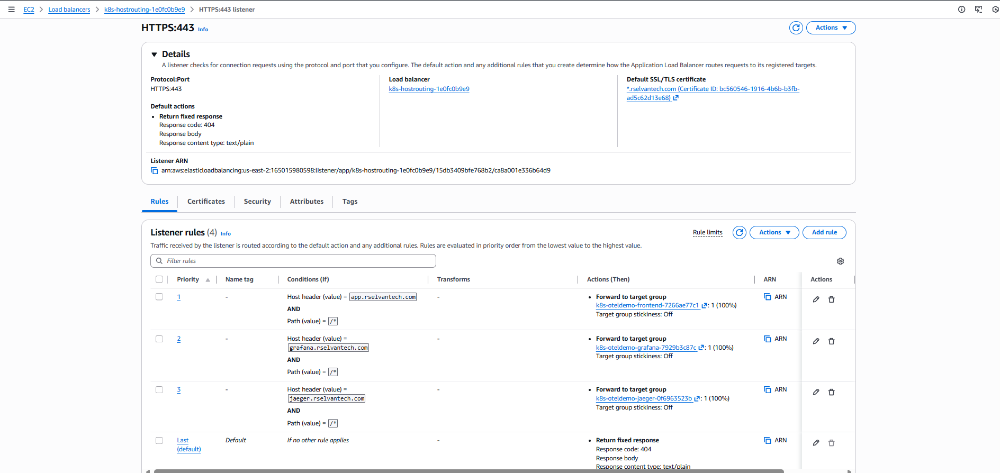

# Demo-06: TLS with ACM (ALB)

## Demo Overview

This demo adds **HTTPS/TLS termination** to the host-based routing from Demo-05 using **AWS Certificate Manager (ACM)**. ACM provides free, automatically-renewing SSL/TLS certificates managed entirely by AWS — no certificate files to manage, no renewal scripts, no expiry surprises.

The ALB terminates TLS at the edge. Traffic inside the cluster between ALB and pods continues over plain HTTP — this is the standard and most common production pattern on EKS.

**What you'll do:**
- Reinstall OTel demo with a Grafana `domain` fix required for host-based routing
- Install external-dns to automate DNS record management in Route53 ( For more details on external-dns, Refer:  [Demo-05: Host-Based Routing](../05-host-based-routing/README.md))
- Request a wildcard ACM certificate for `*.rselvantech.com` using DNS validation
- Validate domain ownership automatically via Route53 (one-click)
- Attach the certificate to the ALB via Ingress annotations
- Configure HTTP → HTTPS redirect so all traffic is encrypted
- Verify HTTPS access to all three subdomains

## Prerequisites

**From Previous Demos:**
- ✅ Completed `00-otel-demo-app` — EKS Cluster and OTel Demo running
- ✅ Completed `01-aws-alb-controller` — ALB Controller installed
- ✅ Completed `05-host-based-routing` - hostbased routing understanding ( perform Demo-05 cleanup , before starting this demo)

**New prerequisite for this demo: (As like for Demo-05)** 
- ✅ Domain `rselvantech.com` registered in Route53
- ✅ Hosted zone auto-created by Route53 at registration


**Verify Prerequisites:**

### 1. Check OTel services exist
```bash
kubectl get svc -n otel-demo frontend-proxy jaeger grafana
```

**Expected:**
```
NAME             TYPE        CLUSTER-IP      EXTERNAL-IP   PORT(S)     AGE
frontend-proxy   ClusterIP   10.100.142.85   <none>        8080/TCP    6m
jaeger           ClusterIP   10.100.98.154   <none>        16686/TCP   6m
grafana          ClusterIP   10.100.167.18   <none>        80/TCP      6m
```

### 2. Check external-dns is running
```bash
kubectl get pods -n external-dns
```

**Expected:**
```
NAME                            READY   STATUS    RESTARTS   AGE
external-dns-5d89c8f8b7-xzp2k   1/1     Running   0          1d
```

### 3. Check subdomains resolve
```bash
dig +short app.rselvantech.com
dig +short grafana.rselvantech.com
dig +short jaeger.rselvantech.com
```

**Expected:** Each returns IP addresses. If not, refer to Demo-05 DNS troubleshooting section.

### 4. Check ALB Controller is running
```bash
kubectl get deployment aws-load-balancer-controller -n kube-system
```

**Expected:**
```
NAME                           READY   UP-TO-DATE   AVAILABLE   AGE
aws-load-balancer-controller   2/2     2            2           1d
```

---

## Demo Objectives

By the end of this demo, you will:

1. ✅ Understand what ACM is and why it is used for TLS on AWS
2. ✅ Understand TLS termination at the ALB and what it means for in-cluster traffic
3. ✅ Understand wildcard certificates vs individual SAN certificates
4. ✅ Understand what DNS validation is and why it is required
5. ✅ Request and validate an ACM wildcard certificate
6. ✅ Attach the certificate to the ALB via Ingress annotations
7. ✅ Implement HTTP → HTTPS redirect
8. ✅ Access all three services over HTTPS

---

## Concepts

### What is ACM?

**AWS Certificate Manager (ACM)** is a managed service that provisions, manages, and automatically renews SSL/TLS certificates for use with AWS services like ALB, CloudFront, and API Gateway.

**Key properties:**
- **Free** — no charge for ACM-managed certificates (you only pay for the AWS resources using them)
- **Automatic renewal** — ACM renews certificates before expiry as long as the DNS validation record remains in place. No manual action required.
- **Private key stays in AWS** — you never handle the private key. It cannot be exported. ACM handles key storage securely.
- **Same-region requirement** — ACM certificates must be requested in the **same AWS region** as the ALB that uses them

**What ACM does NOT do:**
- Does not work with non-AWS infrastructure (Nginx on EC2, on-prem servers) — use cert-manager for that (Demo-07)
- Cannot be used directly on EC2 instances or inside pods — only on AWS managed services (ALB, NLB, CloudFront)

---

### TLS Termination at the ALB

TLS termination means the ALB decrypts the HTTPS traffic and forwards plain HTTP to your pods. This is the standard production pattern on EKS.

```
Browser
  │  HTTPS (encrypted)  port 443
  ▼
ALB  ← TLS termination happens here
  │  HTTP (plain)  port 80
  ▼
Pod (frontend-proxy / grafana / jaeger)
```

**Why terminate at ALB and not end-to-end?**

| | ALB TLS Termination | End-to-End TLS |
|---|---|---|
| Certificate management | ACM handles everything | Must manage certs inside cluster too |
| Performance | ALB offloads decryption from pods | Each pod decrypts independently |
| Complexity | Simple | Complex (cert-manager + pod TLS config) |
| Use case | Public-facing traffic (standard) | Compliance / zero-trust requirements |
| Production adoption | Very common | Required only for strict compliance |

For this demo series, ALB TLS termination is the correct and most widely used approach.

---

### Wildcard Certificate vs Individual SAN Certificate

**Wildcard certificate:**
```
Domain: *.rselvantech.com
Covers: app.rselvantech.com ✅
        grafana.rselvantech.com ✅
        jaeger.rselvantech.com ✅
        anything.rselvantech.com ✅
Does NOT cover: rselvantech.com (apex domain) ✗
                sub.sub.rselvantech.com ✗
```

One certificate covers all current and future subdomains. One DNS validation CNAME record to create and maintain.

**Individual SAN (Subject Alternative Names) certificate:**
```
Domain: rselvantech.com
SANs:   app.rselvantech.com
        grafana.rselvantech.com
        jaeger.rselvantech.com
Covers: exactly the listed names only
```

One certificate explicitly lists each subdomain. Requires a separate DNS validation CNAME per domain listed (though ACM reuses the same CNAME for the apex and wildcard). You must update the certificate when adding new subdomains.

**Comparison:**

| | Wildcard `*.rselvantech.com` | Individual SANs |
|---|---|---|
| New subdomain added | No certificate change needed | Must update cert and revalidate |
| Validation records | 1 CNAME record | 1 CNAME per unique domain |
| Specificity | Broad — covers all subdomains | Precise — only listed names |
| Use case | Demo / dev / many subdomains | Production with locked-down SAN list |
| Cost | Free (ACM) | Free (ACM) |

**For this demo:** Wildcard `*.rselvantech.com` — simpler, covers all subdomains, single validation record.

**To try individual SANs instead (Next Steps):**
Request a certificate with `rselvantech.com` as the primary domain and add `app.rselvantech.com`, `grafana.rselvantech.com`, `jaeger.rselvantech.com` as SANs. One certificate ARN is still used in the Ingress annotation — the ALB uses SNI to serve the correct certificate per hostname.

---

### What is DNS Validation and Why is it Required?

Before ACM can issue a certificate for `*.rselvantech.com`, it must **prove you own the domain**. Anyone could request a certificate for any domain — without proof of ownership, certificates would be meaningless for security.

**How DNS validation works:**

ACM generates a unique CNAME record and asks you to add it to your DNS zone:

```
ACM says: "Add this CNAME to prove you own rselvantech.com"
  _abc123xyz.rselvantech.com  CNAME  _def456uvw.acm-validations.aws.

ACM then queries public DNS for that record.
If the record exists → domain ownership proved → certificate issued.
```

The CNAME must remain in place permanently — ACM uses the same record to prove ownership at each automatic renewal. If you delete it, ACM cannot renew the certificate.

**Why DNS validation over email validation?**

| | DNS Validation | Email Validation |
|---|---|---|
| Renewal | Automatic — no action needed | Manual — must click renewal email each year |
| Works without email setup | Yes | No — requires MX record |
| Route53 integration | One-click — ACM creates record automatically | Not applicable |
| Recommended by AWS | ✅ Yes | Only if DNS access unavailable |

**How Route53 makes DNS validation one-click:**

Since your domain's DNS is managed in Route53 (same AWS account), the ACM console shows a **"Create record in Route 53"** button. One click creates the CNAME validation record in your hosted zone automatically — no manual CLI or console record entry needed.

```
ACM Console
  → Request certificate for *.rselvantech.com
  → Validation method: DNS validation
  → Click "Create record in Route 53"  ← one click
  → ACM creates CNAME in hosted zone
  → ACM detects CNAME (within minutes)
  → Certificate status: ISSUED ✅
```

---

### Architecture & Message Flow

```
                         ┌────────────────────────────┐
                         │  ACM                       │
                         │  *.rselvantech.com         │
                         │  Status: ISSUED            │
                         │  Auto-renews via CNAME ✅  │
                         └──────────────┬─────────────┘
                                        │ certificate ARN
                                        ▼
Browser
GET / HTTPS
Host: grafana.rselvantech.com          ┌────────────────────────────────────────┐
Port: 443 (encrypted)  ──────────────► │  AWS Application Load Balancer         │
                                        │                                        │
                                        │  Port 80  HTTP Listener                │
                                        │    Rule: redirect all → HTTPS 443      │
                                        │                                        │
                                        │  Port 443  HTTPS Listener              │
                                        │    TLS terminated here (ACM cert)      │
                                        │    Rule 1: Host=app.rselvantech.com    │
                                        │            → frontend-proxy:8080       │
                                        │    Rule 2: Host=grafana.rselvantech.com│
                                        │            → grafana:80      ◄─────────┘
                                        │    Rule 3: Host=jaeger.rselvantech.com │
                                        │            → jaeger:16686              │
                                        │    Default: 404                        │
                                        └────────────────────────────────────────┘
                                                       │ HTTP (plain, port 80)
                                        ┌──────────────▼──────────────────────────┐
                                        │  EKS  otel-demo  namespace              │
                                        │  frontend-proxy:8080                    │
                                        │  grafana:80                             │
                                        │  jaeger:16686                           │
                                        └─────────────────────────────────────────┘
```

**HTTP → HTTPS redirect flow:**
```
Browser: GET http://app.rselvantech.com/
ALB port 80: 301 → https://app.rselvantech.com/
Browser: GET https://app.rselvantech.com/
ALB port 443: TLS terminate → forward HTTP to frontend-proxy:8080
```

---

## Directory Structure

```
06-tls-acm-alb/
├── README.md
└── src/
    └── albc-ingress-tls.yaml                # ALB Ingress with TLS + HTTP→HTTPS redirect
    ├── otel-demo-app-values.yaml            # OTel demo values (Grafana domain fix added)
    ├── external-dns-iam-policy.json         # external-dns: IAM policy for external-dns to access Route53
    └── external-dns-values.yaml             # external-dns: Helm values for external-dns
```

> **No new controllers to install.** ACM is a native AWS service — no Helm chart, no pods, no IRSA. The ALB Controller already installed in Demo-01 handles attaching the ACM certificate to the ALB via the `certificate-arn` annotation.

> **external-dns continues working unchanged** — DNS records from Demo-05 remain. Only the ALB listener configuration changes (adds HTTPS on port 443, adds redirect on port 80).

---

## Part 00: Reinstall OTel Demo App with Grafana HTTPS Fix

### Step 0: Understanding the Grafana root_url HTTPS Change

**What changed and why:**

In Demo-05, `otel-demo-app-values.yaml` set Grafana's `root_url` to:

```ini
root_url = http://grafana.rselvantech.com/grafana
```

This was correct for Demo-05 where only HTTP was available. Now that TLS is in place and all traffic runs over HTTPS, Grafana's server-side redirect `Location` header still generates `http://` — causing an unnecessary extra redirect hop:

```
1. Browser: GET https://grafana.rselvantech.com/
        ↓
2. ALB port 443: TLS terminated → forwards HTTP to Grafana pod
        ↓
3. Grafana: 301 Location: http://grafana.rselvantech.com/grafana/
        ↓
4. Browser: GET http://grafana.rselvantech.com/grafana/
        ↓
5. ALB port 80: 301 Location: https://grafana.rselvantech.com:443/grafana/
        ↓
6. Browser: GET https://grafana.rselvantech.com/grafana/
        ↓
7. ALB port 443: TLS terminated → forwards HTTP to Grafana pod
        ↓
8. Grafana: 200 OK → serves dashboard ✅
```
It works because the ssl-redirect: "443" annotation on port 80 catches the HTTP drop at step 4 and bounces it back to HTTPS at step 5.

So functionally it works — but it has 2 extra hops (steps 4 and 5) compared to the clean flow:


```
Clean (after fix):
1. GET https://grafana.rselvantech.com/
2. ALB 443 → Grafana
3. Grafana: 301 Location: https://grafana.rselvantech.com/grafana/
4. GET https://grafana.rselvantech.com/grafana/
5. ALB 443 → Grafana → 200 OK ✅
```

**The fix:**

Update `root_url` in `otel-demo-app-values.yaml` from `http://` to `https://`:

```yaml
grafana:
  grafana.ini:
    server:
      domain: grafana.rselvantech.com
      root_url: "https://grafana.rselvantech.com/grafana"   # ← http changed to https
      serve_from_sub_path: true
```

**Important:** `root_url` must always match the protocol the browser uses to reach Grafana. This value needs to be updated whenever the protocol changes (e.g. adding TLS, changing domain).

---

### Step 1: Uninstall and Reinstall OTel Demo

> As per OTel demo documentation, `helm upgrade` is not recommended. Always uninstall and reinstall.

```bash
helm uninstall otel-demo -n otel-demo
```

Wait for all pods to terminate:

```bash
kubectl get pods -n otel-demo
```

**Expected:**
```
No resources found in otel-demo namespace.
```

Reinstall with updated values file:

```bash
cd 06-tls-acm-alb/src

helm install otel-demo open-telemetry/opentelemetry-demo \
  --version 0.40.2 \
  --namespace otel-demo \
  --create-namespace \
  --values otel-demo-app-values.yaml
```

Wait for all pods to be ready:

```bash
kubectl get pods -n otel-demo -w
```

**Expected: All pods Running**

---

### Step 2: Verify Grafana HTTPS Fix

```bash
# Confirm root_url uses https
kubectl exec -n otel-demo deployment/grafana -- \
  cat /etc/grafana/grafana.ini | grep root_url
```

**Expected:**
```
root_url = https://grafana.rselvantech.com/grafana
```

```bash
# Confirm redirect uses https
curl -v https://grafana.rselvantech.com/ 2>&1 | grep -i location
```

**Expected:**
```
< location: https://grafana.rselvantech.com/grafana/  ✅
```

---

## Part 01: Install external-dns

### Step a: Get Hosted Zone ID

```bash
export ZONE_ID=$(aws route53 list-hosted-zones-by-name \
  --dns-name rselvantech.com \
  --query "HostedZones[0].Id" \
  --output text | cut -d'/' -f3)
echo "Zone ID: $ZONE_ID"
```

**Expected:**
```
Zone ID: Z1234567890ABCDEF
```

---

### Step b: Create IAM Policy

```bash

aws iam create-policy \
  --policy-name AllowExternalDNSUpdates \
  --policy-document file://external-dns-iam-policy.json

export POLICY_ARN=$(aws iam list-policies \
  --query 'Policies[?PolicyName==`AllowExternalDNSUpdates`].Arn' \
  --output text)
echo "Policy ARN: $POLICY_ARN"
```

---

### Step c: Create IRSA (IAM Role for Service Account)

```bash
eksctl get cluster
export CLUSTER_NAME=<your-cluster-name>
# export AWS_REGION=<your-region> 

# Associate OIDC provider (skip if already done in a previous demo)
# eksctl utils associate-iam-oidc-provider \
#   --cluster $CLUSTER_NAME \
#   --approve

# Create namespace
kubectl create namespace external-dns

# Create IAM ServiceAccount
# eksctl creates: IAM role + trust policy + Kubernetes ServiceAccount
# with the IAM role ARN annotation applied automatically
eksctl create iamserviceaccount \
  --cluster $CLUSTER_NAME \
  --namespace external-dns \
  --name external-dns \
  --attach-policy-arn $POLICY_ARN \
  --approve \
  --override-existing-serviceaccounts
```

**Verify the IAM role annotation was applied:**

```bash
kubectl get serviceaccount external-dns -n external-dns -o yaml | grep role-arn
```

**Expected:**
```
eks.amazonaws.com/role-arn: arn:aws:iam::123456789012:role/eksctl-...
```

---

### Step d: Install external-dns via Helm

```bash
helm repo add external-dns https://kubernetes-sigs.github.io/external-dns/
helm repo update

helm upgrade --install external-dns external-dns/external-dns \
  --version 1.20.0 \
  --namespace external-dns \
  --values external-dns-values.yaml
```

**Verify pod is running:**

```bash
kubectl get pods -n external-dns
```

**Expected:**
```
NAME                            READY   STATUS    RESTARTS   AGE
external-dns-5d89c8f8b7-xzp2k   1/1     Running   0          45s
```

**Verify logs show Route53 connectivity:**

```bash
kubectl logs -n external-dns -l app.kubernetes.io/name=external-dns --tail=10
```

**Expected:**
```
time="..." level=info msg="Connected to cluster"
time="..." level=info msg="All records are already up to date"
```

---

## Part A: Request ACM Certificate

### Step 1: Request Wildcard Certificate

> **Important:** ACM certificates for ALB must be requested in the **same region as your EKS cluster**. Confirm your region before proceeding.

```bash
# Confirm your region
aws configure get region
```

**Option 1 — AWS Console (recommended — simplest validation):**

```
ACM Console → Request certificate
  → Certificate type: Public certificate → Next
  → Fully qualified domain name: *.rselvantech.com
  → Add another name to this certificate: rselvantech.com   ← add apex domain too
  → Validation method: DNS validation  ← recommended
  → Key algorithm: RSA 2048
  → Request
```

> Adding `rselvantech.com` alongside `*.rselvantech.com` is best practice — the wildcard does not cover the apex domain itself.

**Option 2 — AWS CLI:**

```bash
aws acm request-certificate \
  --domain-name "*.rselvantech.com" \
  --subject-alternative-names "rselvantech.com" \
  --validation-method DNS \
  --region <your-region>
```

---

### Step 2: Validate Domain Ownership (Route53 one-click)

**In ACM Console:**

```
ACM → Certificates → select your new certificate (Status: Pending validation)
  → Domains section → click "Create record in Route 53"
  → Confirm → Create records
```

ACM automatically adds the CNAME validation record to your Route53 hosted zone.

**Verify the CNAME was added:**

```bash
export ZONE_ID=$(aws route53 list-hosted-zones-by-name \
  --dns-name rselvantech.com \
  --query "HostedZones[0].Id" \
  --output text | cut -d'/' -f3)

aws route53 list-resource-record-sets \
  --hosted-zone-id $ZONE_ID \
  --query "ResourceRecordSets[?Type=='CNAME'].[Name,Type,ResourceRecords[0].Value]" \
  --output table
```

**Expected:** A CNAME record with `_` prefix pointing to `acm-validations.aws`:
```
+--------------------------------------------+-------+--------------------------------------------+
|  _abc123.rselvantech.com.                  | CNAME | _xyz789.acm-validations.aws.               |
+--------------------------------------------+-------+--------------------------------------------+
```

**Monitor certificate status:**

```bash
# Get certificate ARN
export CERT_ARN=$(aws acm list-certificates \
  --query "CertificateSummaryList[?DomainName=='*.rselvantech.com'].CertificateArn" \
  --output text)
echo "Certificate ARN: $CERT_ARN"

# Watch status
aws acm describe-certificate \
  --certificate-arn $CERT_ARN \
  --query "Certificate.{Status:Status,Domain:DomainName}" \
  --output table
```

**Expected (within 1-5 minutes):**
```
+------------------+---------------------+
|  Domain          |  Status             |
+------------------+---------------------+
|  *.rselvantech.com | ISSUED            |
+------------------+---------------------+
```

> If status stays `PENDING_VALIDATION` beyond 5 minutes, check the CNAME propagated: `dig +short _abc123.rselvantech.com CNAME`

---

## Part B: Attach Certificate to ALB

### Step 3: Understanding the ALB TLS Ingress Configuration

Review `src/albc-ingress-tls.yaml` key annotations:

**`alb.ingress.kubernetes.io/certificate-arn`**
The ACM certificate ARN to attach to the HTTPS listener. The ALB Controller reads this and configures the ALB's port 443 listener with the certificate. Multiple ARNs can be specified (comma-separated) for multiple certificates — the ALB uses SNI to select the correct one per hostname.

**`alb.ingress.kubernetes.io/listen-ports: '[{"HTTP":80},{"HTTPS":443}]'`**
Tells the ALB to open two listeners — port 80 (HTTP) and port 443 (HTTPS). Without this, only port 80 is created by default. Both ports are needed: port 443 serves real traffic, port 80 exists only to redirect to HTTPS.

**`alb.ingress.kubernetes.io/ssl-redirect: "443"`**
Creates an ALB listener rule on port 80 that redirects all traffic to HTTPS port 443 with HTTP 301. This is a single annotation — the ALB Controller creates the redirect action automatically. No path rewrites or custom actions needed.

**`alb.ingress.kubernetes.io/ssl-policy: ELBSecurityPolicy-TLS13-1-2-2021-06`**
Controls which TLS protocol versions and cipher suites the ALB accepts from clients. `ELBSecurityPolicy-TLS13-1-2-2021-06` supports TLS 1.3 and TLS 1.2 (backwards compatible) — this is the AWS-recommended policy for production use, balancing security and client compatibility.

| Policy | TLS 1.3 | TLS 1.2 | TLS 1.1 | Use case |
|---|---|---|---|---|
| `ELBSecurityPolicy-TLS13-1-2-2021-06` | ✅ | ✅ | ✗ | Recommended — production standard |
| `ELBSecurityPolicy-TLS13-1-3-2021-06` | ✅ | ✗ | ✗ | Strictest — modern clients only |
| `ELBSecurityPolicy-2016-08` | ✗ | ✅ | ✅ | Legacy clients only |

**`alb.ingress.kubernetes.io/group.name: host-routing`**
Same group name as Demo-05. The existing ALB is updated in-place — no new ALB created, just new listeners added to the existing one.

**`spec.rules[].host` — unchanged from Demo-05**
Host-based routing rules are identical. TLS termination is handled at the listener level — routing rules remain host-header based regardless of HTTP or HTTPS.

---

### Step 4: Apply TLS Ingress

```bash
# Export your certificate ARN first
export CERT_ARN=$(aws acm list-certificates \
  --query "CertificateSummaryList[?DomainName=='*.rselvantech.com'].CertificateArn" \
  --output text)
echo "Using certificate: $CERT_ARN"
```

Update `src/albc-ingress-tls.yaml` — replace the placeholder certificate ARN with your actual ARN, then apply:

```bash
cd 06-tls-acm-alb/src

kubectl apply -f albc-ingress-tls.yaml
```

**Wait for ALB to update (~1-2 minutes):**

```bash
kubectl get ingress host-based-tls -n otel-demo -w
```

**Expected:**
```
NAME             CLASS   HOSTS                          ADDRESS                                            PORTS     AGE
host-based-tls   alb     app.rselvantech.com,...        k8s-oteldemo-abc123.us-east-2.elb.amazonaws.com   80, 443   2m
```

**Note**: Note  `80` in the PORTS column — both listeners active.

---

### Step 5: Verify ALB Listeners

```bash
ALB_DNS=$(kubectl get ingress host-based-tls -n otel-demo \
  -o jsonpath='{.status.loadBalancer.ingress[0].hostname}')

ALB_ARN=$(aws elbv2 describe-load-balancers \
  --query "LoadBalancers[?contains(DNSName, '$(echo $ALB_DNS | cut -d'.' -f1)')].LoadBalancerArn" \
  --output text)

aws elbv2 describe-listeners \
  --load-balancer-arn $ALB_ARN \
  --query 'Listeners[*].{Port:Port,Protocol:Protocol,SSL:SslPolicy}' \
  --output table
```

**Expected:**
```
+------+----------+-------------------------------------------+
| Port | Protocol | SSL                                       |
+------+----------+-------------------------------------------+
|  80  | HTTP     | None                                      |
|  443 | HTTPS    | ELBSecurityPolicy-TLS13-1-2-2021-06       |
+------+----------+-------------------------------------------+
```


**Verify HTTPS listener has the certificate:**

```bash
LISTENER_443=$(aws elbv2 describe-listeners \
  --load-balancer-arn $ALB_ARN \
  --query 'Listeners[?Port==`443`].ListenerArn' \
  --output text)

aws elbv2 describe-listener-certificates \
  --listener-arn $LISTENER_443 \
  --query 'Certificates[*].CertificateArn' \
  --output text
```

**Expected:** Your ACM certificate ARN.

**Verify port 80 redirect rule:**

```bash
LISTENER_80=$(aws elbv2 describe-listeners \
  --load-balancer-arn $ALB_ARN \
  --query 'Listeners[?Port==`80`].ListenerArn' \
  --output text)

aws elbv2 describe-rules \
  --listener-arn $LISTENER_80 \
  --query 'Rules[*].{Priority:Priority,Action:Actions[0].Type,Redirect:Actions[0].RedirectConfig}' \
  --output table
```

**Expected:** Default rule with `redirect` action to HTTPS 443.

**Check Listeners, Rules and Certificate in Console**





**About ports 80 in Ingress**

The PORTS column in `kubectl get ingress` only shows ports defined in spec.rules — which is always **HTTP (port 80)** because Kubernetes Ingress spec has no concept of TLS port 443. 

The HTTPS listener is created by the ALB Controller based on the **annotations (certificate-arn, listen-ports, ssl-policy)** — it exists at the AWS ALB level, not the Kubernetes Ingress spec level.

```
kubectl get ingress → shows port 80   ← from spec.rules (Kubernetes level)
ALB actual listeners → port 80 + 443  ← from annotations (AWS level)
```

`describe-listeners` output above confirms both listeners exist and are correctly configured:

```
Port 80  → HTTP   (redirect to HTTPS)
Port 443 → HTTPS  (ELBSecurityPolicy-TLS13-1-2-2021-06 + ACM cert)  ✅
```
The Ingress is working correctly.

---

### Step 6: Test HTTPS Access

**Test HTTP → HTTPS redirect:**

```bash
curl -I http://app.rselvantech.com/
```

**Expected:**
```
HTTP/1.1 301 Moved Permanently
Location: https://app.rselvantech.com/
```

**Test HTTPS:**

```bash
curl -I https://app.rselvantech.com/
```

**Expected:**
```
HTTP/1.1 200 OK
```

**Test Grafana HTTPS:**

```bash
curl -v https://grafana.rselvantech.com/ 2>&1 | grep -E "SSL|issuer|location|HTTP/"
```

**Expected:**
```
*  SSL certificate verify ok
*  issuer: C=US; O=Amazon; CN=Amazon RSA 2048 M03
< HTTP/1.1 301 Moved Permanently
< location: https://grafana.rselvantech.com/grafana/
```

**Test Jaeger HTTPS:**

```bash
curl -I https://jaeger.rselvantech.com/
```

**Expected:**
```
HTTP/1.1 200 OK
```

**Verify certificate details:**

```bash
echo | openssl s_client -connect app.rselvantech.com:443 -servername app.rselvantech.com 2>/dev/null \
  | openssl x509 -noout -subject -issuer -dates
```

**Expected:**
```
subject=CN = *.rselvantech.com
issuer=C = US, O = Amazon, CN = Amazon RSA 2048 M03
notBefore=...
notAfter=...   ← 13 months from issuance
```

**Verify in browser:**

```
https://app.rselvantech.com       → OTel Demo Store (padlock visible)
https://grafana.rselvantech.com   → redirects to /grafana/ (padlock visible)
https://jaeger.rselvantech.com    → Jaeger UI (padlock visible)
```

Click the padlock → Certificate → verify `*.rselvantech.com` issued by Amazon.

---

## Validation Checklist

Before proceeding, verify:

- [ ] ACM certificate status is `ISSUED`
- [ ] Validation CNAME record exists in Route53
- [ ] ALB has both port 80 (HTTP) and port 443 (HTTPS) listeners
- [ ] HTTPS listener has ACM certificate attached
- [ ] `curl -I http://app.rselvantech.com/` returns `301 Location: https://...`
- [ ] `curl -I https://app.rselvantech.com/` returns `200 OK`
- [ ] Grafana HTTPS redirect goes to `https://grafana.rselvantech.com/grafana/`
- [ ] All three subdomains show padlock in browser

---

## Cleanup

```bash
# Remove TLS Ingress (external-dns deletes Route53 records automatically)
kubectl delete -f albc-ingress-tls.yaml

# ACM certificate — keep for Demo-07 (cert-manager comparison) or delete:
aws acm delete-certificate --certificate-arn $CERT_ARN

# Note: Do NOT delete the Route53 validation CNAME record
# It is needed for auto-renewal if you keep the certificate
# external-dns does NOT manage the ACM validation CNAME — it is safe from deletion
```

**Verify cleanup:**

```bash
kubectl get ingress -n otel-demo
```

# Uninstall external-dns
helm uninstall external-dns -n external-dns
kubectl delete namespace external-dns

# Delete IRSA
eksctl delete iamserviceaccount \
  --cluster $CLUSTER_NAME \
  --namespace external-dns \
  --name external-dns

# Delete IAM policy (keep if reusing in Demo-06)
aws iam delete-policy --policy-arn $POLICY_ARN
```

**Verify cleanup:**

```bash
kubectl get pods -n external-dns       # namespace should be gone
kubectl get ingress -n otel-demo       # host-based-tls removed

---

## What You Learned

In this demo, you:
- ✅ Understood what ACM is and how it manages certificates automatically
- ✅ Understood TLS termination at the ALB — the standard production pattern on EKS
- ✅ Understood wildcard vs individual SAN certificates and when to use each
- ✅ Understood DNS validation and why Route53 makes it one-click
- ✅ Requested and validated a wildcard ACM certificate
- ✅ Attached the certificate to the ALB using `certificate-arn` annotation
- ✅ Implemented HTTP → HTTPS redirect using `ssl-redirect` annotation
- ✅ Verified HTTPS access with correct certificate on all three subdomains

**Key Insight:**
ACM + ALB is the simplest and most operationally efficient TLS solution on AWS. Zero certificate management — request once, validate once, never touch again. The trade-off is AWS lock-in: ACM certificates cannot be exported or used outside AWS services. For cloud-portable TLS that works on any infrastructure, Demo-07 covers cert-manager with Let's Encrypt.

---

## Lessons Learned

### 1. ACM Certificate Region Must Match ALB Region

ACM certificates are regional. A certificate requested in `us-east-1` cannot be attached to an ALB in `us-east-2`. Always confirm your cluster region before requesting the certificate.

```bash
# Verify before requesting certificate
aws configure get region
kubectl config current-context
```

**Rule:** Request ACM certificate in the exact same region as your EKS cluster and ALB.

### 2. Wildcard Does Not Cover Apex Domain

`*.rselvantech.com` covers `app.rselvantech.com` but NOT `rselvantech.com` (the apex). Always add the apex domain as a SAN when requesting a wildcard certificate so both are covered by a single certificate.

**Rule:** Always request `*.domain.com` AND `domain.com` together in one certificate.

### 3. Do Not Delete the ACM Validation CNAME Record

The Route53 CNAME record created during validation (`_abc123.rselvantech.com`) must remain in place permanently. ACM uses it to prove ownership at every automatic renewal. Deleting it causes certificate renewal to fail — you will not receive a warning until ~45 days before expiry when ACM sends renewal failure notices.

external-dns does NOT manage this record (it has no `external-dns` annotation) — it will not delete it during Ingress cleanup. But if you manually clean Route53 records, be careful to preserve the `_` prefixed CNAME records.

**Rule:** Never delete CNAME records prefixed with `_` in your hosted zone — these are ACM validation records.

### 4. `ssl-redirect` Annotation Creates the Redirect — No Extra Rule Needed

In Demo-04, creating a redirect required a full JSON action annotation. For HTTP → HTTPS redirect, the ALB Controller has a dedicated shorthand:

```yaml
alb.ingress.kubernetes.io/ssl-redirect: "443"
```

This single annotation creates the redirect rule on port 80 automatically. No `actions.ssl-redirect` JSON annotation required.

**Rule:** Use `ssl-redirect: "443"` for HTTP → HTTPS redirect on ALB. Use `actions.ssl-redirect` JSON only for custom redirect scenarios (different port, path, or status code).

---

## Next Steps

**Demo-07: TLS with cert-manager (Traefik)**
- Install cert-manager
- Configure Let's Encrypt ClusterIssuer with DNS-01 challenge (Route53)
- Request certificates directly inside the cluster
- Traefik serves HTTPS with certificates managed by cert-manager
- Compare: ACM (AWS-native, zero ops) vs cert-manager (portable, any cloud)

**Try Individual SANs instead of wildcard (optional):**

Request a certificate with explicit SANs instead of wildcard:
```bash
aws acm request-certificate \
  --domain-name "rselvantech.com" \
  --subject-alternative-names \
    "app.rselvantech.com" \
    "grafana.rselvantech.com" \
    "jaeger.rselvantech.com" \
  --validation-method DNS \
  --region <your-region>
```

The same `certificate-arn` annotation is used in the Ingress — the ALB uses SNI to match each hostname to the correct SAN in the certificate. Useful when you want to control exactly which subdomains are covered.

---

## Troubleshooting

**Certificate stays in PENDING_VALIDATION:**
```bash
# Check if CNAME was created in Route53
aws route53 list-resource-record-sets \
  --hosted-zone-id $ZONE_ID \
  --query "ResourceRecordSets[?Type=='CNAME'].[Name,ResourceRecords[0].Value]" \
  --output table

# Check CNAME resolves publicly (ACM requires public DNS)
dig +short _abc123.rselvantech.com CNAME @8.8.8.8
```

If CNAME exists but does not resolve publicly — wait 5-10 minutes for DNS propagation.

**ALB not adding HTTPS listener:**
```bash
# Check ALB Controller logs for certificate errors
kubectl logs -n kube-system deployment/aws-load-balancer-controller \
  | grep -i "certificate\|tls\|ssl"

# Verify certificate ARN is correct and status is ISSUED
aws acm describe-certificate --certificate-arn $CERT_ARN \
  --query "Certificate.Status" --output text
```

**Browser shows certificate warning:**
```bash
# Verify certificate covers the subdomain
echo | openssl s_client \
  -connect grafana.rselvantech.com:443 \
  -servername grafana.rselvantech.com 2>/dev/null \
  | openssl x509 -noout -text | grep -A2 "Subject Alternative"
```

Expected: `*.rselvantech.com` in the SAN list.

**HTTP redirect not working:**
```bash
# Verify listen-ports includes both HTTP and HTTPS
kubectl get ingress host-based-tls -n otel-demo \
  -o jsonpath='{.metadata.annotations.alb\.ingress\.kubernetes\.io/listen-ports}'

# Check port 80 listener rule
aws elbv2 describe-rules --listener-arn $LISTENER_80 --output table
```

**curl SSL error:**
```bash
# Test without certificate verification (useful for diagnosing cert mismatch)
curl -k -I https://app.rselvantech.com/

# Check what certificate the ALB is presenting
echo | openssl s_client -connect app.rselvantech.com:443 \
  -servername app.rselvantech.com 2>/dev/null | openssl x509 -noout -subject
```