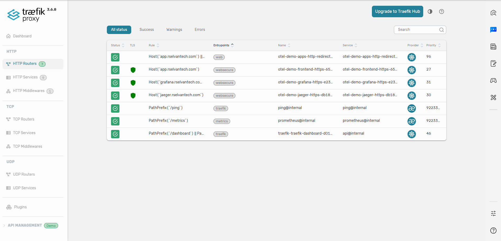
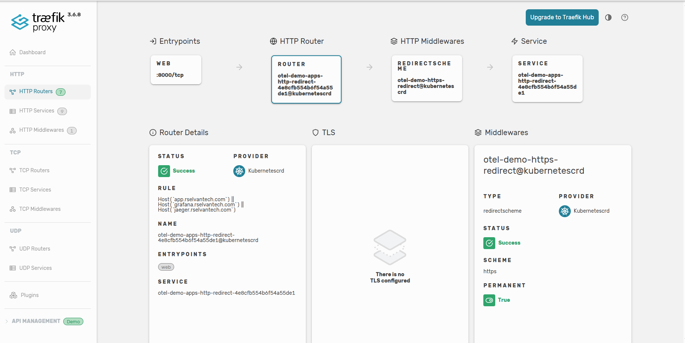
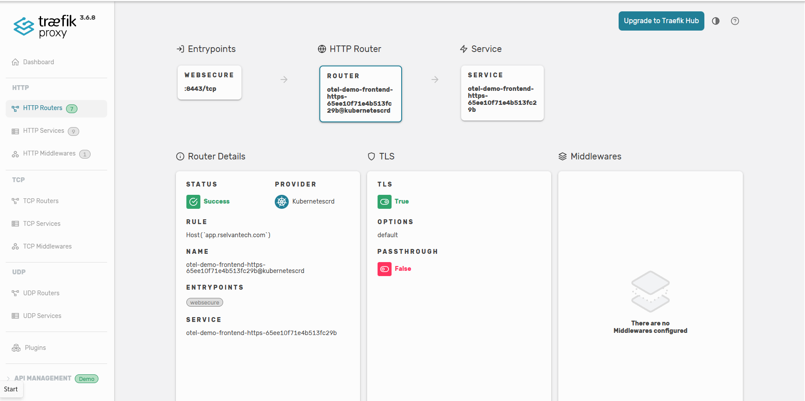
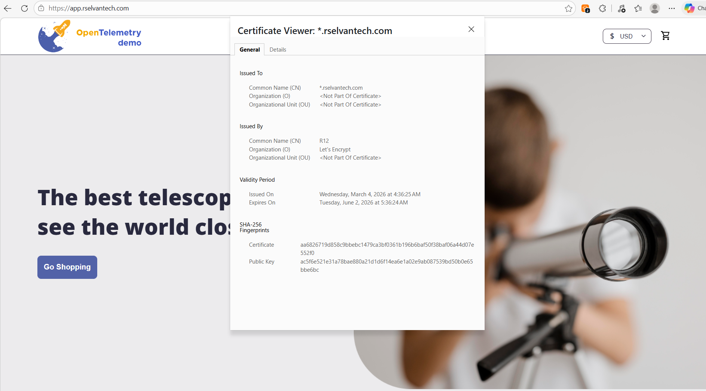

# Demo-07: TLS with cert-manager (Traefik)

## Demo Overview

This demo adds **HTTPS/TLS termination** to Traefik's host-based routing using **cert-manager** with **Let's Encrypt** certificates. Unlike Demo-06 where AWS manages the certificates (ACM), here certificates are managed **inside the cluster** — making this approach cloud-portable and usable on any Kubernetes cluster regardless of cloud provider.

cert-manager automatically requests, validates, and renews Let's Encrypt certificates using the **DNS-01 challenge** with Route53. Traefik serves HTTPS traffic using these certificates stored as Kubernetes Secrets.

**What you'll do:**
- Reinstall OTel demo with Grafana `root_url` set to `https://` (same as Demo-06)
- Install external-dns to automate DNS record management in Route53 (Refer [Demo-05: Host-Based Routing](../05-host-based-routing/README.md))
- Install cert-manager with IRSA for Route53 access
- Create Let's Encrypt staging and production ClusterIssuers with DNS-01 solver
- Request wildcard certificates via Certificate resources
- Configure Traefik IngressRoute to serve HTTPS using cert-manager certificates
- Compare ACM (Demo-06) vs cert-manager (Demo-07)

## Prerequisites

**From Previous Demos:**
- ✅ Completed `00-otel-demo-app` — EKS Cluster and OTel Demo running
- ✅ Completed `02-traefik-controller` — Traefik installed with NLB
- ✅ Completed `05-host-based-routing` — host-based routing understanding
- ✅ Completed `06-tls-acm-alb` — TLS concepts understood

**New prerequisite for this demo: (As like for Demo-05)** 
- ✅ Domain `rselvantech.com` registered in Route53
- ✅ Hosted zone auto-created by Route53 at registration
- ✅ Email verification done  (ICANN requirement, within 15 days)

**Perform Demo-05 & Demo-06 cleanup before starting this demo.**

**Verify Prerequisites:**

### 1. Check OTel services exist
```bash
kubectl get svc -n otel-demo frontend-proxy jaeger grafana
```

**Expected:**
```
NAME             TYPE        CLUSTER-IP      EXTERNAL-IP   PORT(S)     AGE
frontend-proxy   ClusterIP   10.100.142.85   <none>        8080/TCP    6m
jaeger           ClusterIP   10.100.98.154   <none>        16686/TCP   6m
grafana          ClusterIP   10.100.167.18   <none>        80/TCP      6m
```

### 2. Check Traefik service
```bash
kubectl get svc traefik -n traefik
```

**Expected: NLB DNS assigned**
```
NAME      TYPE           CLUSTER-IP      EXTERNAL-IP                                                          PORT(S)                      AGE
traefik   LoadBalancer   10.100.196.90   k8s-traefik-traefik-abc123.elb.us-east-2.amazonaws.com   80:32195/TCP,443:30647/TCP   12m
```

### 3. Check hosted zone exists
```bash
export ZONE_ID=$(aws route53 list-hosted-zones-by-name \
  --dns-name rselvantech.com \
  --query "HostedZones[0].Id" \
  --output text | cut -d'/' -f3)
echo "Zone ID: $ZONE_ID"
```

---

## Demo Objectives

By the end of this demo, you will:

1. ✅ Understand what cert-manager is and how it works
2. ✅ Understand the DNS-01 challenge and why it is used for wildcard certificates
3. ✅ Understand staging vs production Let's Encrypt issuers and rate limits
4. ✅ Understand Certificate and ClusterIssuer Kubernetes resources
5. ✅ Install cert-manager with IRSA for Route53 access
6. ✅ Request a wildcard certificate via DNS-01 challenge
7. ✅ Configure Traefik to serve HTTPS using cert-manager certificates
8. ✅ Compare ACM vs cert-manager approaches

---

## Concepts

### What is cert-manager?

**cert-manager** is a CNCF (Cloud Native Computing Foundation) graduated project that automates certificate management inside Kubernetes. It adds `Certificate`, `ClusterIssuer`, and `Issuer` as Kubernetes custom resources and handles the full certificate lifecycle — request, validate, store as Kubernetes Secret, renew before expiry.

**Key properties:**
- **Cloud-portable** — works on any Kubernetes cluster (AWS, GCP, Azure, on-prem)
- **Multiple issuers** — Let's Encrypt, HashiCorp Vault, self-signed, custom CAs
- **Automatic renewal** — renews certificates ~30 days before expiry
- **Kubernetes-native** — certificates stored as Kubernetes Secrets, consumed directly by Traefik
- **Free certificates** — Let's Encrypt issues free 90-day certificates, cert-manager handles renewal automatically

**How it differs from ACM:**

| | ACM (Demo-06) | cert-manager (Demo-07) |
|---|---|---|
| Where certs live | AWS-managed (cannot export) | Kubernetes Secret (portable) |
| Works outside AWS | No | Yes — any cloud or on-prem |
| Renewal | AWS automatic | cert-manager automatic (90-day certs) |
| Cloud portability | AWS only | Any cloud or on-prem |
| Certificate visibility | AWS Console only | `kubectl get certificate` |
| Configuration | 3 annotations on Ingress | ClusterIssuer + Certificate + IngressRoute |
| Setup complexity | Low | Medium |
| Use case | AWS-only workloads | Multi-cloud, portable, Traefik/nginx |

---

### DNS-01 Challenge — What it is and Why it's Used

When cert-manager requests a certificate from Let's Encrypt, Let's Encrypt must verify you own the domain. There are two challenge types:

**HTTP-01 challenge:**
```
Let's Encrypt: "Serve a file at http://grafana.rselvantech.com/.well-known/acme-challenge/TOKEN"
cert-manager:  creates a temporary Ingress to serve the token file
Let's Encrypt: fetches the file → ownership proved
```
Limitation: **Cannot validate wildcard certificates.** Requires HTTP port 80 publicly accessible.

**DNS-01 challenge:**
```
Let's Encrypt: "Add TXT record: _acme-challenge.rselvantech.com = TOKEN"
cert-manager:  calls Route53 API → creates the TXT record
Let's Encrypt: queries public DNS for the TXT record → ownership proved
cert-manager:  deletes the TXT record after validation
```

**Why DNS-01 for this demo:**
- Wildcard certificates (`*.rselvantech.com`) **require DNS-01** — HTTP-01 cannot validate wildcards
- Works even if HTTP port 80 is not publicly accessible
- No temporary Ingress resources needed
- Route53 integration is native and well-supported in cert-manager

---

### Staging vs Production Let's Encrypt

Let's Encrypt enforces **strict rate limits** on production certificates:
- 50 certificates per registered domain per week
- 5 failed validation attempts per account per hour

If you make configuration mistakes and retry, you can be blocked from issuing certificates for up to a week.

**Always test with staging first:**

| | Staging | Production |
|---|---|---|
| Server | `acme-staging-v02.api.letsencrypt.org` | `acme-v02.api.letsencrypt.org` |
| Rate limits | Very high (for testing) | Strict (production limits) |
| Browser trust | ❌ Not trusted — fake root CA | ✅ Trusted by all browsers |
| Use case | Verify full DNS-01 config works | Real publicly trusted HTTPS |

**Workflow:**
```
1. Create staging ClusterIssuer → request staging cert
2. Verify certificate READY = True  (proves DNS-01 + IRSA + Route53 all work)
3. Create production ClusterIssuer → request production cert
4. Traefik serves browser-trusted HTTPS ✅
```

---

### cert-manager Kubernetes Resources

**ClusterIssuer** — cluster-wide configuration for how to request certificates. Defines the ACME server, your email, and the DNS-01 solver:

```yaml
apiVersion: cert-manager.io/v1
kind: ClusterIssuer
metadata:
  name: letsencrypt-production
spec:
  acme:
    server: https://acme-v02.api.letsencrypt.org/directory
    email: your@email.com
    privateKeySecretRef:
      name: letsencrypt-production-key   # stores ACME account private key
    solvers:
    - dns01:
        route53:
          region: us-east-2
          hostedZoneID: Z0098351FHZVOKGD40KE
```

**Certificate** — requests a specific certificate from a ClusterIssuer and stores it as a Secret:

```yaml
apiVersion: cert-manager.io/v1
kind: Certificate
metadata:
  name: wildcard-rselvantech-prod
  namespace: traefik          # must be same namespace as Traefik
spec:
  secretName: wildcard-rselvantech-prod-tls   # cert stored here
  issuerRef:
    name: letsencrypt-production
    kind: ClusterIssuer
  dnsNames:
  - "*.rselvantech.com"
  - "rselvantech.com"
```

**Secret (auto-created by cert-manager):**
```
wildcard-rselvantech-prod-tls
  tls.crt  ← full certificate chain
  tls.key  ← private key
```

**Traefik IngressRoute** — references the Secret for TLS termination:

```yaml
spec:
  entryPoints:
    - websecure         # port 443
  tls:
    secretName: wildcard-rselvantech-prod-tls   # cert-manager created this
  routes:
    - match: Host(`grafana.rselvantech.com`)
      services:
        - name: grafana
          port: 80
```

**Why `tls.secretName` and not `cert-manager.io/cluster-issuer` annotation:**

The `cert-manager.io/cluster-issuer` annotation triggers auto-certificate creation for standard Kubernetes Ingress resources. Traefik IngressRoute is a CRD — cert-manager does not watch it. The annotation is silently ignored on IngressRoute. The correct approach is to create the Certificate resource explicitly and reference the resulting Secret via `tls.secretName`.

---

### Architecture & Message Flow

```
                    ┌──────────────────────────────────────────────┐
                    │  Let's Encrypt ACME Server                   │
                    │  acme-v02.api.letsencrypt.org                │
                    └──────────────┬───────────────────────────────┘
                                   │ DNS-01 challenge / validation
                                   ▼
                    ┌──────────────────────────────────────────────┐
                    │  Route53  rselvantech.com hosted zone        │
                    │  _acme-challenge TXT ← cert-manager creates  │
                    │  app/grafana/jaeger A ← external-dns manages │
                    └──────────────────────────────────────────────┘
                                   │ certificate issued
                    ┌──────────────▼───────────────────────────────┐
                    │  cert-manager  (cert-manager namespace)      │
                    │  ClusterIssuer: letsencrypt-production       │
                    │  Certificate:  wildcard-rselvantech-prod     │
                    │    → stores in Secret: wildcard-prod-tls     │
                    │    → auto-renews ~30 days before expiry      │
                    └──────────────┬───────────────────────────────┘
                                   │ Kubernetes Secret
                                   ▼
Browser                 ┌──────────────────────────────────────────┐
GET https://            │  Traefik  (traefik namespace / NLB)      │
app.rselvantech.com ──► │                                          │
Port 443 encrypted      │  websecure entrypoint (443)              │
                        │    TLS terminated — cert from Secret     │
                        │    Host(app.rselvantech.com)             │
                        │      → frontend-proxy:8080               │
                        │    Host(grafana.rselvantech.com)         │
                        │      → grafana:80                        │
                        │    Host(jaeger.rselvantech.com)          │
                        │      → jaeger:16686                      │
                        │                                          │
                        │  web entrypoint (80)                     │
                        │    Middleware: https-redirect            │
                        │      301 → https://                      │
                        └──────────────────────────────────────────┘
                                   │ HTTP plain
                        ┌──────────▼───────────────────────────────┐
                        │  EKS  otel-demo  namespace               │
                        │  frontend-proxy / grafana / jaeger       │
                        └──────────────────────────────────────────┘
```

**HTTP → HTTPS redirect flow (Traefik):**
```
Browser: GET http://app.rselvantech.com/
Traefik web (port 80): Middleware https-redirect → 301 https://app.rselvantech.com/
Browser: GET https://app.rselvantech.com/
Traefik websecure (port 443): TLS terminate → forward HTTP to frontend-proxy:8080
```

---

## Directory Structure
```
07-tls-cert-manager-traefik/
├── README.md
└── src/
    ├── otel-demo/
    │   └── otel-demo-app-values.yaml              # OTel demo values (https root_url)
    │
    ├── external-dns/
    │   ├── external-dns-iam-policy.json           # IAM policy for external-dns Route53 access
    │   └── external-dns-values.yaml               # Helm values for external-dns
    │
    ├── cert-manager/
    │   ├── cert-manager-iam-policy.json           # IAM policy for cert-manager Route53 access
    │   ├── cert-manager-values.yaml               # Helm values for cert-manager
    │   ├── clusterissuer-staging.yaml             # Let's Encrypt staging ClusterIssuer
    │   ├── clusterissuer-production.yaml          # Let's Encrypt production ClusterIssuer
    │   ├── certificate-staging.yaml               # Staging wildcard certificate (test)
    │   └── certificate-production.yaml            # Production wildcard certificate
    │
    └── traefik/
        ├── traefik-middleware-https-redirect.yaml # HTTP → HTTPS redirect Middleware
        └── traefik-ingressroute-https.yaml        # Traefik IngressRoutes (HTTPS + redirect)
```

---

## Part 00: Reinstall OTel Demo App

### Step 0: Understanding the Grafana root_url Change

Same as Demo-06 — `root_url` must use `https://` since all traffic runs over HTTPS.

```yaml
# src/otel-demo/otel-demo-app-values.yaml
grafana:
  grafana.ini:
    server:
      domain: grafana.rselvantech.com
      root_url: "https://grafana.rselvantech.com/grafana"
      serve_from_sub_path: true
```

> **Note:** If running this demo immediately after Demo-06 on the same cluster, OTel demo is already installed with `https` root_url — skip the reinstall. Verify with:
> ```bash
> kubectl exec -n otel-demo deployment/grafana -- cat /etc/grafana/grafana.ini | grep root_url
> ```

### Step 1: Uninstall and Reinstall OTel Demo

```bash
cd 07-tls-cert-manager-traefik/src

helm uninstall otel-demo -n otel-demo

helm install otel-demo open-telemetry/opentelemetry-demo \
  --version 0.40.2 \
  --namespace otel-demo \
  --create-namespace \
  --values otel-demo/otel-demo-app-values.yaml

kubectl get pods -n otel-demo -w
```

**Expected: All pods Running.**

### Step 2: Verify Grafana HTTPS Fix

```bash
kubectl exec -n otel-demo deployment/grafana -- \
  cat /etc/grafana/grafana.ini | grep root_url
```

**Expected:**
```
root_url = https://grafana.rselvantech.com/grafana
```

---

## Part 01: Install external-dns

Follow [Demo-05: Host-Based Routing — Part A: Install external-dns](../05-host-based-routing/README.md#part-a-install-external-dns) for the full install steps using `src/external-dns/external-dns-iam-policy.json` and `src/external-dns/external-dns-values.yaml`.

> [!NOTE]
> Demo-07 uses a component-grouped directory structure. When following Demo-05 instructions, use these file paths:
> - IAM Policy: `external-dns/iam-policy.json`
> - Helm Values: `external-dns/values.yaml`

After installation, **annotate the Traefik Service** so external-dns manages DNS records pointing to the NLB:

```bash
kubectl annotate service traefik -n traefik \
  "external-dns.alpha.kubernetes.io/hostname=app.rselvantech.com,grafana.rselvantech.com,jaeger.rselvantech.com"
```

> **Why annotate the Service (not IngressRoute):** external-dns reads the NLB hostname from `Service.status.loadBalancer.ingress[0].hostname`. IngressRoute CRD has no `.status.loadBalancer` field. See Demo-05 concepts: *How external-dns Discovers the Load Balancer Hostname*.

**Verify DNS records created:**

```bash
kubectl logs -n external-dns -l app.kubernetes.io/name=external-dns --tail=20
```

**Expected:**
```
Desired change: CREATE app.rselvantech.com A
Desired change: CREATE grafana.rselvantech.com A
Desired change: CREATE jaeger.rselvantech.com A
3 record(s) successfully updated
```

---

## Part A: Install cert-manager

### Step 3: Understanding the cert-manager IAM Policy

cert-manager needs Route53 access to create and delete `_acme-challenge` TXT records during DNS-01 validation.

```json
{
  "Version": "2012-10-17",
  "Statement": [
    {
      "Effect": "Allow",
      "Action": "route53:GetChange",
      "Resource": "arn:aws:route53:::change/*"
    },
    {
      "Effect": "Allow",
      "Action": [
        "route53:ChangeResourceRecordSets",
        "route53:ListResourceRecordSets"
      ],
      "Resource": "arn:aws:route53:::hostedzone/*"
    },
    {
      "Effect": "Allow",
      "Action": "route53:ListHostedZonesByName",
      "Resource": "*"
    }
  ]
}
```

**Why these permissions and how they differ from external-dns:**

| Permission | cert-manager | external-dns | Reason |
|---|---|---|---|
| `route53:GetChange` | ✅ Required | ✗ Not needed | cert-manager polls change propagation status before notifying Let's Encrypt. external-dns creates long-lived records and does not need to confirm propagation. |
| `route53:ChangeResourceRecordSets` | ✅ Required | ✅ Required | Creates/deletes TXT records (cert-manager) and A/ALIAS records (external-dns) |
| `route53:ListResourceRecordSets` | ✅ Required | ✅ Required | Reads existing records |
| `route53:ListHostedZonesByName` | ✅ Required | ✅ Required | Discovers hosted zone ID from domain name |

---

### Step 4: Create IAM Policy for cert-manager

```bash
aws iam create-policy \
  --policy-name CertManagerRoute53Access \
  --policy-document file://cert-manager/cert-manager-iam-policy.json

export CERT_MANAGER_POLICY_ARN=$(aws iam list-policies \
  --query 'Policies[?PolicyName==`CertManagerRoute53Access`].Arn' \
  --output text)
echo "Policy ARN: $CERT_MANAGER_POLICY_ARN"
```

---

### Step 5: Create IRSA for cert-manager

cert-manager's Helm chart creates a ServiceAccount named `cert-manager` in the `cert-manager` namespace. IRSA annotates this ServiceAccount with the IAM role ARN so cert-manager pods can call the Route53 API.

```bash
export CLUSTER_NAME=<your-cluster-name>

# Create namespace first (eksctl needs it to exist or creates it)
kubectl create namespace cert-manager 

eksctl create iamserviceaccount \
  --cluster $CLUSTER_NAME \
  --namespace cert-manager \
  --name cert-manager \
  --attach-policy-arn $CERT_MANAGER_POLICY_ARN \
  --approve \
  --override-existing-serviceaccounts
```

**Verify IRSA annotation is present on the ServiceAccount:**

```bash
kubectl get serviceaccount cert-manager -n cert-manager \
  -o jsonpath='{.metadata.annotations}'
```

**Expected:**
```
arn:aws:iam::123456789012:role/eksctl-your-cluster-addon-iamserviceaccount...
```

---

### Step 6: Install cert-manager via Helm

**App Version: v1.19.4** — current LTS (Long Term Support) release.

```bash
helm repo add jetstack https://charts.jetstack.io
helm repo update

helm upgrade --install cert-manager jetstack/cert-manager \
  --version v1.19.4 \
  --namespace cert-manager \
  --create-namespace \
  --values cert-manager/cert-manager-values.yaml
```

**Verify pods running:**

```bash
kubectl get pods -n cert-manager
```

**Expected:**
```
NAME                                       READY   STATUS    RESTARTS   AGE
cert-manager-xxxxxxxxxx-xxxxx              1/1     Running   0          60s
cert-manager-cainjector-xxxxxxxxxx-xxxxx   1/1     Running   0          60s
cert-manager-webhook-xxxxxxxxxx-xxxxx      1/1     Running   0          60s
```

Three pods:
- `cert-manager` — main controller, processes Certificate and Issuer resources
- `cert-manager-cainjector` — injects CA bundles into Kubernetes webhook configurations
- `cert-manager-webhook` — validates cert-manager CRD resources at admission time

---

### Step 7: Understanding cert-manager Helm Values

Review `src/cert-manager-values.yaml` key parameters:

**`crds.enabled: true`**
Installs cert-manager Custom Resource Definitions (Certificate, ClusterIssuer, Issuer, CertificateRequest, Order, Challenge) as part of the Helm release. Without this, CRDs must be installed separately before the chart. This is the recommended approach since cert-manager v1.15.

**`serviceAccount.create: false` + `serviceAccount.name: cert-manager`**
Do not create a new ServiceAccount — use the pre-existing one created by eksctl with the IRSA annotation in the above step. If `create: true`, Helm overwrites the eksctl-created ServiceAccount losing the IAM role annotation, breaking Route53 access.

**`extraArgs: ["--issuer-ambient-credentials=true"]`**
Tells cert-manager to use the ambient AWS credentials available in the pod environment (from IRSA token projection) when no explicit credentials are provided in the ClusterIssuer. **Required for IRSA** — without this flag, cert-manager ignores the IRSA-injected credentials entirely and Route53 API calls fail with `NoCredentialProviders`.

**`securityContext.fsGroup: 1001`**
Required for cert-manager to read the projected IRSA ServiceAccount token from the filesystem. The IRSA token is mounted as a projected volume — the `fsGroup` ensures the file has correct permissions for the cert-manager process to read it.

---

## Part B: Configure Let's Encrypt Issuers

### Step 8: Create Staging ClusterIssuer

```bash
echo "Zone ID: $ZONE_ID"
```

> [!NOTE]
> Edit `cert-manager/clusterissuer-staging.yaml` file. In below line replace capture your above `Zone ID`
>            `hostedZoneID: REPLACE_WITH_YOUR_ZONE_ID`


```bash
kubectl apply -f cert-manager/clusterissuer-staging.yaml
```

**Verify ClusterIssuer registered with Let's Encrypt:**

```bash
kubectl get clusterissuer letsencrypt-staging
```

**Expected:**
```
NAME                  READY   AGE
letsencrypt-staging   True    30s
```

`READY = True` means cert-manager successfully registered an ACME account with Let's Encrypt staging.

If `READY = False`:

```bash
kubectl describe clusterissuer letsencrypt-staging
# Look for: Status.Conditions[].Message — common issues:
# - Network connectivity to ACME server
# - Invalid email address format
```

---

### Step 9: Request Staging Certificate

```bash
kubectl apply -f cert-manager/certificate-staging.yaml
```

**Watch certificate status:**

```bash
kubectl get certificate -n traefik -w
```

**Expected progression:**
```
NAME                      READY   SECRET                    AGE
wildcard-rselvantech-stg  False   wildcard-rselvantech-stg  10s
wildcard-rselvantech-stg  True    wildcard-rselvantech-stg  2m
```

`READY = True` — Let's Encrypt issued the staging certificate and cert-manager stored it as a Secret.

**Watch DNS-01 challenge in action:**

```bash
kubectl logs -n cert-manager deployment/cert-manager -f \
  | grep -i "route53\|acme\|challenge\|dns"
```

**Expected log sequence:**
```
Presenting DNS01 challenge for domain rselvantech.com
Created TXT record _acme-challenge.rselvantech.com in Route53
Waiting for DNS propagation
DNS record confirmed — notifying ACME server
Challenge validated successfully
Certificate issued and stored in Secret
Cleaning up TXT record _acme-challenge.rselvantech.com
```

**Check order status**

```bash
kubectl get order -n traefik
```

**Expected output**
```
NAME                                    STATE     AGE
wildcard-rselvantech-stg-1-2300723576   pending   21m        #If all challenges succeeds, state changes to 'valid' 
```

**Check challenge status (visible during validation):**

> [!NOTE]
> Once all challenges transition to `valid` state, below challenge records will be removed and 
> above order record will move to 'valid' state 

```bash
kubectl get challenges -n traefik
```

**Expected output**
```
NAME                                               STATE     DOMAIN            AGE
wildcard-rselvantech-stg-1-2300723576-1109276532   valid     rselvantech.com   2m59s
wildcard-rselvantech-stg-1-2300723576-1251074652   pending   rselvantech.com   2m59s
```


**if any challenges are pending - Check status and events**

```bash
kubectl describe challenge -n traefik  # if any challenges are pending
```

**Verify TXT record cleanup (should be empty after validation):**

```bash
aws route53 list-resource-record-sets \
  --hosted-zone-id $ZONE_ID \
  --query "ResourceRecordSets[?Type=='TXT'].[Name,Type]" \
  --output table
```

After validation completes, the `_acme-challenge` TXT record is deleted automatically.

---

### Step 10: Create Production ClusterIssuer and Certificate

Only proceed after staging `READY = True` — this confirms DNS-01, IRSA, and Route53 all work correctly.

```bash
kubectl apply -f cert-manager/clusterissuer-production.yaml
kubectl apply -f cert-manager/certificate-production.yaml
```

**Watch production certificate:**

```bash
kubectl get certificate -n traefik -w
```

**Expected:**
```
NAME                        READY   SECRET                        AGE
wildcard-rselvantech-stg    True    wildcard-rselvantech-stg      5m
wildcard-rselvantech-prod   True    wildcard-rselvantech-prod-tls 2m
```

**Verify Secret created in traefik namespace:**

```bash
kubectl get secret wildcard-rselvantech-prod-tls -n traefik
```

**Expected:**
```
NAME                           TYPE                DATA   AGE
wildcard-rselvantech-prod-tls  kubernetes.io/tls   2      2m
```

`DATA: 2` = `tls.crt` (certificate chain) and `tls.key` (private key).

---

## Part C: Configure Traefik HTTPS

### Step 11: Understanding the Traefik HTTPS Configuration

**HTTP → HTTPS redirect in Traefik vs ALB:**

| | ALB (Demo-06) | Traefik (Demo-07) |
|---|---|---|
| Redirect config | `ssl-redirect: "443"` annotation | Explicit `Middleware` resource |
| How it works | ALB Controller creates redirect rule | Traefik applies Middleware to all HTTP routes |
| Resource type | Annotation (no separate resource) | `Middleware` CRD in traefik namespace |

**Traefik redirect Middleware:**

```yaml
apiVersion: traefik.io/v1alpha1
kind: Middleware
metadata:
  name: https-redirect
  namespace: traefik
spec:
  redirectScheme:
    scheme: https
    permanent: true    # HTTP 301
```

**Two IngressRoutes per service:**

Unlike ALB which handles both HTTP and HTTPS in one Ingress, Traefik requires separate IngressRoutes for each entrypoint:

```
IngressRoute on web (port 80):
  → applies https-redirect Middleware
  → all hosts match → 301 to https://

IngressRoute on websecure (port 443):
  → tls.secretName: wildcard-rselvantech-prod-tls
  → routes to backend services
```

**Why the Certificate must be in the `traefik` namespace:**

Kubernetes Secrets are namespace-scoped. Traefik reads the Secret referenced in `tls.secretName`. Traefik can only access Secrets in its own namespace (`traefik`). If the Certificate is created in `otel-demo` namespace, the Secret is there — Traefik cannot read it and HTTPS fails. The Certificate resource must always be created in the `traefik` namespace.

---

### Step 12: Create HTTP → HTTPS Redirect Middleware

```bash
kubectl apply -f traefik/traefik-middleware-https-redirect.yaml
```

**Verify:**

```bash
kubectl get middleware -n traefik
```

**Expected:**
```
NAME             AGE
https-redirect   10s
```

---

### Step 13: Apply Traefik HTTPS IngressRoutes

```bash
kubectl apply -f traefik/traefik-ingressroute-https.yaml
```

**Verify routes:**

```bash
kubectl get ingressroute -n otel-demo
```

**Expected:**
```
NAME                   AGE
apps-http-redirect     10s    ← HTTP → HTTPS redirect (all 3 hosts)
frontend-https         10s    ← HTTPS for app.rselvantech.com
grafana-https          10s    ← HTTPS for grafana.rselvantech.com
jaeger-https           10s    ← HTTPS for jaeger.rselvantech.com
```

**Check Traefik dashboard to verify routes loaded:**

```bash
kubectl port-forward -n traefik deployment/traefik 9000:9000
```

Open http://localhost:9000/dashboard/ → HTTP → Routers

Verify both `web` (HTTP redirect) and `websecure` (HTTPS) routers appear for all three hosts.






---

### Step 14: Test HTTPS Access

**Test HTTP → HTTPS redirect:**

```bash
curl -I http://app.rselvantech.com/
```

**Expected:**
```
HTTP/1.1 301 Moved Permanently
Location: https://app.rselvantech.com/
```

**Test HTTPS:**

```bash
curl -I https://app.rselvantech.com/
```

**Expected:**
```
HTTP/1.1 200 OK
```

**Verify certificate is from Let's Encrypt (not staging fake CA):**

```bash
echo | openssl s_client \
  -connect app.rselvantech.com:443 \
  -servername app.rselvantech.com 2>/dev/null \
  | openssl x509 -noout -subject -issuer -dates
```

**Expected:**
```
subject=CN = *.rselvantech.com
issuer=C = US, O = Let's Encrypt, CN = R12
notBefore=...
notAfter=...   ← 90 days from issuance
```

**Test Grafana HTTPS:**

```bash
curl -v https://grafana.rselvantech.com/ 2>&1 | grep -E "issuer|location|HTTP/"
```

**Expected:**
```
issuer: C=US; O=Let's Encrypt; CN=R10
< HTTP/2 301
< location: https://grafana.rselvantech.com/grafana/
```

**Test Jaeger HTTPS:**

```bash
curl -I https://jaeger.rselvantech.com/
```

**Expected:**
```
HTTP/1.1 200 OK
```

**Verify in browser:**

```
https://app.rselvantech.com       → OTel Demo Store (padlock — Let's Encrypt)
https://grafana.rselvantech.com   → redirects to /grafana/ (padlock — Let's Encrypt)
https://jaeger.rselvantech.com    → Jaeger UI (padlock — Let's Encrypt)
```

Click padlock → Certificate → Issued by: **Let's Encrypt R12** (not Amazon).



---

## Part D: ACM vs cert-manager Comparison

### Step 15: Side-by-Side Comparison

| Aspect | ACM + ALB (Demo-06) | cert-manager + Traefik (Demo-07) |
|---|---|---|
| **Certificate issuer** | AWS Certificate Manager | Let's Encrypt via cert-manager |
| **Certificate location** | AWS-managed (no export) | Kubernetes Secret (portable) |
| **TLS termination** | ALB (AWS network edge) | Traefik pod (inside cluster) |
| **Cert validity** | 13 months, auto-renewed | 90 days, auto-renewed ~30 days before expiry |
| **Renewal** | AWS fully automatic | cert-manager automatic |
| **Cloud portability** | AWS only | Any cloud or on-prem |
| **Certificate visibility** | AWS Console + ACM API | `kubectl get certificate` |
| **HTTP redirect config** | `ssl-redirect: "443"` annotation | Explicit `Middleware` resource |
| **IRSA needed** | No | Yes (cert-manager needs Route53) |
| **Setup complexity** | Low — 3 annotations | Medium — ClusterIssuer + Certificate + routes |
| **Production adoption** | AWS-native teams | Multi-cloud, cloud-agnostic teams |

**When to use ACM (Demo-06 approach):**
- AWS-only infrastructure
- Minimal operational complexity preferred
- ALB is already the ingress controller

**When to use cert-manager (Demo-07 approach):**
- Multi-cloud or hybrid deployments
- Certificates needed inside the cluster (pod-to-pod mTLS)
- Using Traefik, nginx, or any non-ALB ingress controller
- Team prefers Kubernetes-native tooling over AWS-specific services

---

## Validation Checklist

Before proceeding, verify:

- [ ] cert-manager pods all running (`cert-manager`, `cainjector`, `webhook`)
- [ ] IRSA annotation present on `cert-manager` ServiceAccount
- [ ] `--issuer-ambient-credentials` in cert-manager args
- [ ] Staging ClusterIssuer `READY = True`
- [ ] Staging certificate `READY = True` (proves DNS-01 + IRSA + Route53 work)
- [ ] Production ClusterIssuer `READY = True`
- [ ] Production certificate `READY = True`
- [ ] Secret `wildcard-rselvantech-prod-tls` exists in `traefik` namespace
- [ ] Traefik Middleware `https-redirect` created
- [ ] `curl -I http://app.rselvantech.com/` returns `301 Location: https://...`
- [ ] `curl -I https://app.rselvantech.com/` returns `200 OK`
- [ ] Certificate issuer shows `Let's Encrypt` (not Amazon or staging fake CA)
- [ ] All three subdomains show padlock in browser

---

## Cleanup

```bash
# Remove Traefik IngressRoutes and Middleware
kubectl delete -f src/traefik-ingressroute-https.yaml
kubectl delete -f src/traefik-middleware-https-redirect.yaml

# Remove Certificates and ClusterIssuers
kubectl delete -f src/certificate-production.yaml
kubectl delete -f src/certificate-staging.yaml
kubectl delete -f src/clusterissuer-production.yaml
kubectl delete -f src/clusterissuer-staging.yaml

# Uninstall cert-manager
helm uninstall cert-manager -n cert-manager
kubectl delete namespace cert-manager

# Delete IRSA for cert-manager
eksctl delete iamserviceaccount \
  --cluster $CLUSTER_NAME \
  --namespace cert-manager \
  --name cert-manager

# Delete IAM policy
aws iam delete-policy --policy-arn $CERT_MANAGER_POLICY_ARN

# Remove external-dns Traefik Service annotation
kubectl annotate service traefik -n traefik \
  external-dns.alpha.kubernetes.io/hostname-

# Uninstall external-dns
helm uninstall external-dns -n external-dns
kubectl delete namespace external-dns

eksctl delete iamserviceaccount \
  --cluster $CLUSTER_NAME \
  --namespace external-dns \
  --name external-dns

aws iam delete-policy --policy-arn $POLICY_ARN
```

**Verify cleanup:**

```bash
kubectl get pods -n cert-manager        # namespace gone
kubectl get certificate -n traefik      # certificates gone
kubectl get ingressroute -n otel-demo   # routes gone
kubectl get pods -n external-dns        # namespace gone
```

---

## What You Learned

In this demo, you:
- ✅ Understood cert-manager and how it differs from ACM
- ✅ Understood DNS-01 challenge and why it is required for wildcard certificates
- ✅ Understood staging vs production Let's Encrypt and why to test staging first
- ✅ Understood Certificate and ClusterIssuer as Kubernetes-native resources
- ✅ Installed cert-manager with IRSA for Route53 DNS-01 validation
- ✅ Requested a wildcard certificate via DNS-01 and verified the full challenge flow
- ✅ Configured Traefik IngressRoute with HTTPS using cert-manager certificates
- ✅ Implemented HTTP → HTTPS redirect using Traefik Middleware
- ✅ Compared ACM vs cert-manager and understood when to use each

**Key Insight:**
cert-manager makes TLS portable — the same ClusterIssuer and Certificate setup works on AWS, GCP, Azure, or bare metal. ACM is simpler on AWS but is tied to AWS services. In practice, many production teams use both: ACM for ALB-terminated TLS on public traffic, and cert-manager for internal service-to-service mTLS inside the cluster.

---

## Lessons Learned

### 1. Always Test with Staging ClusterIssuer First

Let's Encrypt production enforces strict rate limits — 50 certificates per domain per week, 5 failed validations per hour. Configuration mistakes during setup consume your quota. Always validate the full DNS-01 + IRSA + Route53 chain with staging before creating a production ClusterIssuer.

**Rule:** Staging cert `READY = True` → then and only then switch to production.

### 2. cert-manager Requires `--issuer-ambient-credentials` for IRSA

IRSA correctly annotates the ServiceAccount and projects the token into the pod — but cert-manager does not use ambient AWS credentials by default. Without `--issuer-ambient-credentials=true` in `extraArgs`, cert-manager ignores the IRSA token entirely and Route53 calls fail silently with `NoCredentialProviders`. This is the most common cert-manager + IRSA failure.

**Rule:** Always set `extraArgs: ["--issuer-ambient-credentials=true"]` in cert-manager Helm values when using IRSA.

### 3. Certificate Must Be in the Same Namespace as Traefik

cert-manager creates a Kubernetes Secret from the Certificate resource in the same namespace as the Certificate. Traefik reads Secrets referenced in `tls.secretName` but only from its own namespace (`traefik`). Creating Certificate in `otel-demo` or `default` namespace puts the Secret in the wrong namespace — Traefik cannot access it and HTTPS fails.

**Rule:** Always create Certificate resources in the `traefik` namespace.

### 4. Use `tls.secretName` in IngressRoute — Not `cert-manager.io/cluster-issuer` Annotation

The `cert-manager.io/cluster-issuer` annotation on Kubernetes Ingress resources triggers cert-manager to auto-request a certificate. This does **not** work on Traefik IngressRoute CRDs — cert-manager does not watch IngressRoute resources and silently ignores the annotation. Always create the Certificate resource explicitly and reference the resulting Secret via `tls.secretName` in the IngressRoute.

**Rule:** For Traefik — create Certificate explicitly, use `tls.secretName`. The `cert-manager.io/cluster-issuer` annotation is for standard Kubernetes Ingress only.

### 5. Grafana root_url Must Match the Protocol in Every Demo

`root_url` must always match the protocol the browser uses to reach Grafana:

| Demo | root_url | Reason |
|---|---|---|
| Demo-05 | `http://grafana.rselvantech.com/grafana` | HTTP only |
| Demo-06 | `https://grafana.rselvantech.com/grafana` | HTTPS via ACM |
| Demo-07 | `https://grafana.rselvantech.com/grafana` | HTTPS via cert-manager |

**Rule:** Whenever the protocol or domain changes, update `root_url` in `otel-demo-app-values.yaml` before reinstalling. Incorrect `root_url` causes Grafana to generate `http://` Location headers even over HTTPS — resulting in extra redirect hops through the HTTP→HTTPS redirect.

### 6. external-dns Annotation Goes on Traefik Service, Not IngressRoute

For Traefik, external-dns reads the NLB hostname from `Service.status.loadBalancer.ingress[0].hostname`. IngressRoute CRD has no `.status.loadBalancer` field — external-dns cannot discover the NLB hostname from it. Annotating the Traefik Service (not the IngressRoute) is required.

For ALB, external-dns reads from `Ingress.status.loadBalancer.ingress[0].hostname` — the annotation goes on the Ingress object. This difference is covered in Demo-05 Lessons Learned.

**Rule:** Traefik — annotate the Service. ALB — annotate the Ingress.

---

## Next Steps

**Demo-08: Basic Authentication**
- Protect Grafana and Jaeger behind HTTP Basic Auth using Traefik `basicAuth` Middleware
- Generate bcrypt-hashed credentials as Kubernetes Secret
- Apply per-route authentication

---

## Troubleshooting

**cert-manager pods not starting:**
```bash
kubectl describe pod -n cert-manager -l app=cert-manager | tail -20
kubectl logs -n cert-manager -l app=cert-manager
```

**ClusterIssuer not ready (`READY = False`):**
```bash
kubectl describe clusterissuer letsencrypt-staging
# Look for Status.Conditions[].Message
# Common causes: network to ACME server, invalid email, IRSA not working
```

**Certificate stuck not-ready:**
```bash
# Check challenge status
kubectl get challenges -n traefik
kubectl describe challenge -n traefik

# Check cert-manager logs for errors
kubectl logs -n cert-manager deployment/cert-manager \
  | grep -E "error|route53|acme|challenge" | tail -20
```

**Route53 access denied (IRSA issue):**
```bash
# Verify IRSA annotation
kubectl get sa cert-manager -n cert-manager \
  -o jsonpath='{.metadata.annotations.eks\.amazonaws\.io/role-arn}'

# Verify --issuer-ambient-credentials is set
kubectl get deployment cert-manager -n cert-manager \
  -o jsonpath='{.spec.template.spec.containers[0].args}' | tr ',' '\n' | grep ambient
```

**DNS-01 TXT record not propagating:**
```bash
# Check if TXT record was created in Route53
dig +short _acme-challenge.rselvantech.com TXT @8.8.8.8

# cert-manager waits for propagation before notifying Let's Encrypt
kubectl logs -n cert-manager deployment/cert-manager | grep -i "waiting\|propagat"
```

**Traefik returns 404 on HTTPS:**
```bash
# Verify Secret exists in traefik namespace (not otel-demo)
kubectl get secret -n traefik | grep tls

# Verify IngressRoute references correct secretName
kubectl get ingressroute -n otel-demo -o yaml | grep secretName

# Check Traefik logs
kubectl logs -n traefik deployment/traefik | grep -i "tls\|cert\|error"
```

**Browser shows staging certificate (fake CA / not trusted):**
```bash
# Verify production certificate is Ready
kubectl get certificate -n traefik

# Verify IngressRoute references production Secret (not staging)
kubectl get ingressroute -n otel-demo grafana-https -o yaml | grep secretName

# Should show: wildcard-rselvantech-prod-tls (not stg)
```

**Let's Encrypt rate limit hit:**
```bash
# Check certificate events
kubectl describe certificate wildcard-rselvantech-prod -n traefik | grep -A5 Events

# If rate limited — wait up to 1 week or use staging to continue testing
# Rate limit info: https://letsencrypt.org/docs/rate-limits/
```